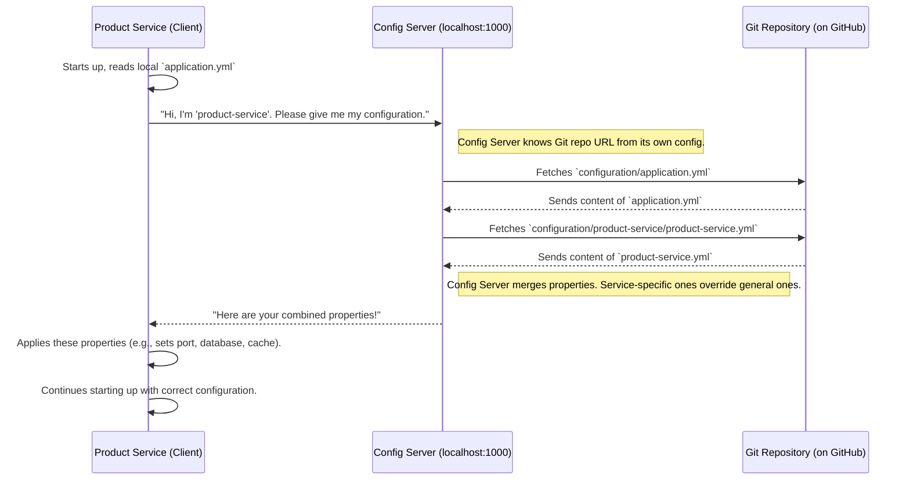

# Chapter 1: Centralized Configuration Management

Welcome to the E-Commerce Microservice project tutorial! We're thrilled to have you on board. In this very first chapter, we'll dive into a fundamental concept for managing complex applications made of many small services: **Centralized Configuration Management**.

## Why Do We Need This? The Problem of Scattered Settings

Imagine you're building a big online store. This store isn't just one giant program; it's made of many small, specialized programs called **microservices**. You might have:
*   A `product-service` to manage all product information.
*   An `order-service` to handle customer orders.
*   A `user-service` to manage user accounts.
*   And maybe many more!

Each of these services needs some settings to work correctly:
*   "Which database should I connect to?"
*   "What's the password for that database?"
*   "On what network port should I listen for requests?"
*   "What's the logging level (e.g., show only errors, or show detailed information)?"

Now, if you only have one or two services, you could just put a little settings file inside each one. Easy, right?

But what happens when your online store grows and you have 10, 20, or even 50 microservices?
And what if you have different settings for:
*   Your **development** machine (where you write code).
*   A **testing** environment (where quality assurance happens).
*   The **production** environment (the live website your customers use).

If each service has its own separate configuration files, changing a common setting (like a database password or a shared API key) becomes a nightmare! You'd have to:
1.  Find the settings file in *every single service*.
2.  Manually edit each file.
3.  Rebuild and redeploy each service.

This is slow, tedious, and very easy to make mistakes (like forgetting to update one service, or making a typo).

**This is the problem Centralized Configuration Management solves.**

## What is Centralized Configuration Management?

Instead of each microservice keeping its own "notes" (configuration files), we create a **central place** where all important settings are stored. Think of it like a **master "policy manual"** or a "settings directory" for the entire application.

In our project, this central place is managed by a special service called a **Config Server**. This Config Server gets its information from a **Git repository** (a place where code and files are stored with version history).

Here's the idea:
1.  All configuration files (like database URLs, passwords, port numbers, etc.) are stored in a single Git repository.
2.  We have a **Config Server** whose job is to read these files from the Git repository.
3.  When any of our other microservices (like `product-service` or `order-service`) start up, they don't look for settings files on their own computer. Instead, they "call" the Config Server and say, "Hey, I'm the `product-service`, can you give me my settings?"
4.  The Config Server then provides the correct settings to that service.

**Benefits:**
*   **Simplicity:** Manage settings for all services and all environments (development, testing, production) in one place.
*   **Consistency:** Ensures all services use the correct and consistent settings.
*   **Easy Updates:** Change a setting in the central Git repository, and (often with a refresh or restart) services pick up the new values. No more manual updates across dozens of files!
*   **Dynamic Updates (Advanced):** In some cases, you can even change settings while services are running, without needing to restart them!
*   **History & Control:** Because we use Git, we have a full history of every configuration change.

## How It Works in Our Project

Let's look at how our `E-Commerce-Microservice-master` project uses this.

### 1. The Client Microservice (e.g., `product-service`)

When a service like `product-service` starts, it needs to know where to find this "master settings directory" (the Config Server).

Take a look at this snippet from `product-service/src/main/resources/application.yml`:

```yaml
spring:
  application:
    name: product-service # (1) My name is 'product-service'
  config:
    import: optional:configserver:http://localhost:1000 # (2) Get settings from here!
```

Let's break this down:
*   **(1) `spring.application.name: product-service`**: This line gives our microservice a name. It's like the service introducing itself. When it talks to the Config Server, it will say, "Hi, I'm `product-service`, please give me *my* specific settings."
*   **(2) `spring.config.import: optional:configserver:http://localhost:1000`**: This is the crucial part. It tells the `product-service`:
    *   `configserver:`: "You need to fetch your configuration from a Spring Cloud Config Server."
    *   `http://localhost:1000`: "That Config Server is running on your local machine (`localhost`) at port `1000`."
    *   `optional:`: "If you can't reach the Config Server, it's okay to try and start anyway (though you might be missing some settings)." For critical settings, you might remove `optional:`.

So, when `product-service` boots up, one of the first things it does is make a network call to `http://localhost:1000` to ask for its configuration.

### 2. The Config Server (`config-server` module)

Now, let's look at the `config-server` itself. This is a separate microservice whose only job is to provide configurations.

First, the main application class in `config-server/src/main/java/com/example/config/ConfigServerApplication.java`:

```java
package com.example.config;

import org.springframework.boot.SpringApplication;
import org.springframework.boot.autoconfigure.SpringBootApplication;
import org.springframework.cloud.config.server.EnableConfigServer; // Import this

@SpringBootApplication
@EnableConfigServer // (1) This makes it a Config Server!
public class ConfigServerApplication {

	public static void main(String[] args) {
		SpringApplication.run(ConfigServerApplication.class, args);
	}
}
```
*   **(1) `@EnableConfigServer`**: This single annotation is like a magic switch. It tells Spring Boot, "Hey, this application isn't a regular web app; it's a Config Server! Activate all the special Config Server features."

Next, how does the Config Server know where to find the actual configuration files (the "master policy manual")? It's configured in its own `application.yml` file, located at `config-server/src/main/resources/application.yml`:

```yaml
server:
  port: 1000 # (1) I will listen on port 1000

spring:
  cloud:
    config:
      server:
        git: # (2) My settings are in a Git repository
          uri: https://github.com/rajumb0232/E-Commerce-Microservice.git # (3)
          default-label: master # (4) Use the 'master' branch
          searchPaths: # (5) Look in these folders within the Git repo
            - configuration
            - configuration/user-service
            - configuration/order-service
            - configuration/product-service
```
Let's understand this:
*   **(1) `server.port: 1000`**: This tells the Config Server to run on port `1000`. This matches the URL that `product-service` uses to contact it.
*   **(2) `git:`**: This section specifies that the configurations are stored in a Git repository.
*   **(3) `uri: https://github.com/rajumb0232/E-Commerce-Microservice.git`**: This is the web address of the Git repository where our configuration files live.
*   **(4) `default-label: master`**: By default, the Config Server will look for configuration files in the `master` branch of this Git repository. You could use other branches for different environments (e.g., a `develop` branch for development settings).
*   **(5) `searchPaths:`**: These are the specific folders *inside* the Git repository where the Config Server will look for configuration files.
    *   It will look for general files (like `application.yml`) and service-specific files (like `product-service.yml`).

### 3. The Configuration Files in Git

The actual settings are stored as YAML files within the Git repository specified above (under the `configuration` directory).

There are two main types of configuration files:

**a) General Configuration (`configuration/application.yml`):**
This file contains settings that might be common to *all* or *most* microservices.

```yaml
server:
  port: 0 # (1) Let services pick a random available port

spring:
  # DATASOURCE CONFIGURATION (example for all services)
  datasource:
    url: ${DB_URL} # (2) Placeholder for database URL
    username: ${DB_USERNAME}
    password: ${DB_PASSWORD}
  # ... other common settings ...
  cloud:
    consul: # Settings for Service Discovery (more on this later!)
      host: ${CONSUL_HOST:localhost}
      port: ${CONSUL_PORT:8500}
# ...
```
*   **(1) `server.port: 0`**: This interesting setting tells Spring Boot to pick a random available port for the microservice when it starts. This is useful to avoid port conflicts if you run many services on one machine.
*   **(2) `${DB_URL}`, `${DB_USERNAME}`, `${DB_PASSWORD}`**: These are placeholders. The actual values can be provided when the application runs, often through environment variables. This is a secure way to handle sensitive data like passwords.

**b) Service-Specific Configuration (e.g., `configuration/product-service/product-service.yml`):**
These files contain settings that are specific to *one particular microservice*. The file name matches the `spring.application.name` of the service.

```yaml
#  APP CONFIGURATION (INTERNAL for product-service)
app:
  base-url: /api/v1/products # (1) API path just for product service

spring:
  # Service Discovery configuration (specific to product-service)
  cloud:
    consul:
      discovery:
        metadata:
          basePath: ${app.base-url}
  cache:
    type: redis # (2) Product service uses Redis for caching
  redis:
    host: "${REDIS_HOST:localhost}" # Redis details
    port: "${REDIS_PORT:6379}"
```
*   **(1) `app.base-url: /api/v1/products`**: This defines a base URL path that is specific to the `product-service`.
*   **(2) `spring.cache.type: redis`**: This tells the `product-service` to use Redis (a fast in-memory data store) for caching, along with its connection details. Other services might not use Redis, or might use it differently.

**How Settings are Combined:**
When `product-service` asks the Config Server for its settings, the Config Server is smart:
1.  It first loads the general settings from `configuration/application.yml`.
2.  Then, it loads the specific settings from `configuration/product-service/product-service.yml`.
3.  If there's a setting with the same name in both files (e.g., if `application.yml` had a `spring.cache.type` and `product-service.yml` also had one), the **service-specific setting wins**. This allows you to have general defaults and then override them for particular services.

## The Flow: A Step-by-Step Journey

Let's trace what happens when `product-service` starts up:



1.  **`product-service` Starts**: It reads its own `application.yml` and sees the `spring.config.import` instruction telling it to contact `http://localhost:1000`.
2.  **Contacts Config Server**: `product-service` sends a request to the Config Server, identifying itself by its name (`product-service`).
3.  **Config Server Works**:
    *   The Config Server (running on port `1000`) receives this request.
    *   It checks its own configuration (`config-server/src/main/resources/application.yml`) to find the Git repository URL (`uri`), branch (`default-label`), and `searchPaths`.
    *   It connects to the specified Git repository.
4.  **Fetches Files from Git**:
    *   It looks in the `searchPaths` (e.g., `configuration/` and `configuration/product-service/`).
    *   It downloads `application.yml` (for general settings) and `product-service.yml` (for `product-service` specific settings).
5.  **Combines and Sends**:
    *   The Config Server reads all the properties from these files.
    *   It intelligently merges them, with service-specific properties taking precedence over general ones if there are overlaps.
    *   It sends this complete, merged set of configuration properties back to the `product-service` over the network.
6.  **`product-service` Applies Configuration**:
    *   `product-service` receives these settings.
    *   It applies them as if they were written in its own local configuration files. For example, it will set up its database connection, configure its cache, and know its API base path.
    *   The service then finishes starting up, fully configured!

## Conclusion

You've just learned about a powerful pattern for managing application settings: **Centralized Configuration Management** using a Spring Cloud Config Server backed by a Git repository.

**Key Takeaways:**
*   It solves the problem of managing scattered configuration files in a microservice architecture.
*   A **Config Server** acts as a central source of truth for settings.
*   Microservices (like `product-service`) fetch their configuration from this Config Server when they start.
*   Configurations are typically stored in a **Git repository**, providing version control and easy management of settings for different environments.
*   This approach promotes consistency, simplifies updates, and makes your microservice application much easier to manage as it grows.

This is a foundational concept for building robust microservice systems. By centralizing configuration, we lay the groundwork for more organized and scalable applications.

In the next chapter, we'll explore another critical component: how requests from users or other systems are routed to the correct microservice. Get ready to learn about [API Gateway & Dynamic Routing](02_api_gateway___dynamic_routing_.md)!

---

