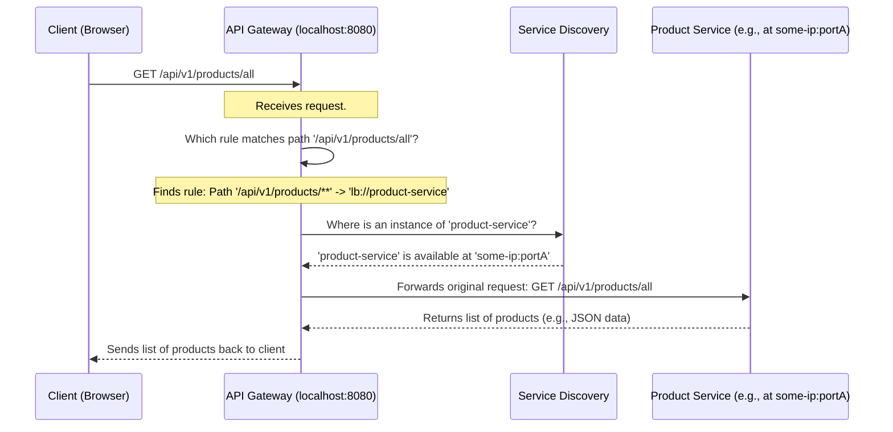

# Chapter 2: API Gateway & Dynamic Routing

Welcome back! In [Chapter 1: Centralized Configuration Management](01_centralized_configuration_management_.md), we saw how to keep all our microservice settings in one central place. Now, let's tackle another big question: with all these separate services, how do users and other applications actually *talk* to them without getting lost?

Imagine our e-commerce application has several microservices:
*   `product-service` (manages products)
*   `order-service` (handles orders)
*   `user-service` (manages user accounts)

If a customer's mobile app wants to fetch product details, should it know the exact network address (like `192.168.1.10:8001`) of the `product-service`? And what if that address changes, or we add more copies of `product-service` for better performance? The mobile app would need to be updated constantly. This would be a nightmare!

This is where an **API Gateway** comes to the rescue.

## What is an API Gateway? The Main Receptionist

Think of our entire microservice application as a large company with many specialized departments (product department, order department, etc.). An **API Gateway** is like the **main receptionist** for this company.

*   **Single Entry Point:** Instead of clients (like a mobile app or a web browser) needing to know the "direct phone number" of every single department (microservice), they only need to know one number: the receptionist's (the API Gateway's address).
*   **Routing Requests:** When a call (a client request) comes in, the receptionist (API Gateway) figures out which department (microservice) should handle it and forwards the call.
*   **Hiding Complexity:** The client doesn't need to know how many departments there are, where they are located, or if their locations change. The receptionist handles all that.

In our `E-Commerce-Microservice-master` project, we have a dedicated service called `api-gateway` that acts as this receptionist.

## What is "Dynamic Routing"? The Receptionist's Smart Directory

So, how does our API Gateway "receptionist" know where to send requests? It uses a "smart directory" that's always up-to-date. This is where **Service Discovery** and **Dynamic Routing** come in.

1.  **Service Registration (Checking In):**
    *   Remember from [Chapter 1](01_centralized_configuration_management_.md) how services like `product-service` had Consul settings?
    *   When `product-service` starts, it registers itself with **Consul** (our Service Discovery tool). It's like a department telling the receptionist, "Hi, I'm the Product Department, and you can currently reach me at extension 8001."
    *   Consul keeps a list of all available services and their current locations (IP address and port).

2.  **Dynamic Route Creation (Updating the Directory):**
    *   The API Gateway continuously checks with Consul to see which services are available and where they are.
    *   It then **dynamically** creates routing rules. For example, it learns that any request starting with `/api/v1/products` should go to the `product-service`.
    *   "Dynamic" means these rules can change automatically if a service moves, new services are added, or services go offline. The gateway adapts.

## How It Works in Our Project

Let's see how the `api-gateway` service is set up to do this.

### 1. The API Gateway Service (`api-gateway` module)

This is a Spring Boot application whose main job is to be our gateway. Its `ApiGatewayApplication.java` is very simple:

```java
// File: api-gateway/src/main/java/com/example/api_gateway/ApiGatewayApplication.java
package com.example.api_gateway;

import org.springframework.boot.SpringApplication;
import org.springframework.boot.autoconfigure.SpringBootApplication;

@SpringBootApplication // (1) Standard Spring Boot app
public class ApiGatewayApplication {

	public static void main(String[] args) {
		SpringApplication.run(ApiGatewayApplication.class, args);
	}
}
```
*   **(1) `@SpringBootApplication`**: This makes it a regular Spring Boot application. The magic for being a gateway comes from its dependencies (like `spring-cloud-starter-gateway`) and configuration.

### 2. API Gateway Configuration (`api-gateway/src/main/resources/application.yml`)

This file tells the API Gateway how to behave:

```yaml
# File: api-gateway/src/main/resources/application.yml
server:
  port: 8080 # (1) Gateway listens on port 8080

spring:
  application:
    name: api-gateway # (2) Its name is 'api-gateway'
  main:
    allow-bean-definition-overriding: true

  cloud:
    consul: # (3) Settings to find Consul
      host: localhost
      port: 8500
      discovery:
        prefer-ip-address: true
        # register: true # Optional: gateway can also register itself in Consul

    gateway:
      discovery:
        locator: # (4) Enable discovery-based routing
          enabled: true
          lower-case-service-id: true # (5) Important for matching service names
          # (6) Only create routes for services with 'basePath' metadata
          include-expression: metadata['basePath'] != null
```
Let's break this down:
*   **(1) `server.port: 8080`**: The API Gateway will listen for incoming client requests on port `8080`. This is the single address clients will use.
*   **(2) `spring.application.name: api-gateway`**: The name of this service.
*   **(3) `spring.cloud.consul...`**: These settings tell the API Gateway where to find Consul (our service discovery tool), which is running on `localhost:8500`.
*   **(4) `gateway.discovery.locator.enabled: true`**: This is a key setting! It tells Spring Cloud Gateway to automatically look for services registered in Consul and create routes to them.
*   **(5) `lower-case-service-id: true`**: This ensures that if a service registered itself as `PRODUCT-SERVICE` in Consul, the gateway will still correctly create a route using the lowercase `product-service`. This is often used for consistency.
*   **(6) `include-expression: metadata['basePath'] != null`**: This is a very important filter. It tells the gateway: "Only create automatic routes for services that have a piece of information called `basePath` in their metadata in Consul."

    *   **What's `basePath`?** Remember in [Chapter 1](01_centralized_configuration_management_.md), in the `product-service.yml` file (stored in the Git config repo), we had:
        ```yaml
        # configuration/product-service/product-service.yml
        app:
          base-url: /api/v1/products # This defines the base path for product APIs
        
        spring:
          cloud:
            consul:
              discovery:
                metadata:
                  basePath: ${app.base-url} # (!!) This puts it in Consul metadata
        ```
        This `basePath: /api/v1/products` metadata is registered with Consul by the `product-service`. The API Gateway will read this! It means: "If a request comes to the Gateway starting with `/api/v1/products`, then it should be routed to the `product-service`."

### 3. Custom Logic for Dynamic Routes (`DynamicRouteDefinitionLocator.java`)

While the `application.yml` settings provide good basic dynamic routing, our project also includes a custom Java class, `DynamicRouteDefinitionLocator.java`, for more fine-grained control over how routes are created. This class allows for more complex logic if needed, such as handling multiple base paths for a single service.

Here's a simplified view of what it does:

```java
// File: api-gateway/src/main/java/com/example/api_gateway/config/DynamicRouteDefinitionLocator.java
// (Simplified for explanation)
// ... imports ...

@Configuration
@Slf4j
@AllArgsConstructor
public class DynamicRouteDefinitionLocator implements RouteDefinitionLocator {

    private final DiscoveryClient discoveryClient; // (1) Tool to talk to Consul

    @Override
    public Flux<RouteDefinition> getRouteDefinitions() { // (2) Gateway asks this for routes
        List<RouteDefinition> routeDefinitions = new ArrayList<>();

        discoveryClient.getServices().forEach(serviceId -> { // (3) For each service in Consul...
            List<ServiceInstance> instances = discoveryClient.getInstances(serviceId);
            if (instances.isEmpty()) return;

            instances.forEach(instance -> { // (4) For each instance of that service...
                Map<String, String> metadata = instance.getMetadata();
                String basePath = metadata != null ? metadata.get("basePath") : null; // (5) Get basePath

                if (basePath != null && !basePath.isBlank()) {
                    // (Simplified) Create a route definition using this basePath
                    var routeDef = buildSingleRouteDefinition(serviceId, basePath);
                    routeDefinitions.add(routeDef);
                    log.debug("Registered route for service '{}' at path '{}'", serviceId, basePath);
                }
            });
        });
        return Flux.fromIterable(routeDefinitions); // (6) Return all created routes
    }

    // Helper method to build a single route definition (simplified)
    private static RouteDefinition buildSingleRouteDefinition(String serviceId, String path) {
        RouteDefinition routeDefinition = new RouteDefinition();
        // Unique ID for the route, e.g., "product-service-/api/v1/products"
        routeDefinition.setId(serviceId + "-" + path.replaceAll("[^a-zA-Z0-9\\-]", "_"));
        // (7) Where to send the request: "lb" means load-balanced to the service
        routeDefinition.setUri(URI.create("lb://" + serviceId));

        // (8) When this rule should apply: if the request path matches
        PredicateDefinition predicate = new PredicateDefinition();
        predicate.setName("Path"); // Match based on URL path
        predicate.addArg("_genkey_0", path + "/**"); // e.g., "/api/v1/products/**"

        routeDefinition.setPredicates(List.of(predicate));
        return routeDefinition;
    }
    // ... The actual file has more logic for multiple paths etc. ...
}
```
Let's understand the key parts:
*   **(1) `DiscoveryClient discoveryClient`**: This is Spring Cloud's way to interact with the Service Discovery system (Consul in our case). It can ask Consul for a list of all registered services.
*   **(2) `getRouteDefinitions()`**: Spring Cloud Gateway calls this method to get the list of routing rules.
*   **(3) `discoveryClient.getServices().forEach(...)`**: The code iterates through each service ID (like `product-service`, `order-service`) that Consul knows about.
*   **(4) `discoveryClient.getInstances(serviceId).forEach(...)`**: For each service, it gets its available instances (a service might be running on multiple servers for reliability).
*   **(5) `String basePath = metadata.get("basePath")`**: For each service instance, it fetches its metadata and looks for the `basePath` key – just like we configured in `product-service.yml`!
*   **(6) `Flux.fromIterable(routeDefinitions)`**: It returns all the route rules it has constructed.
*   **(7) `routeDefinition.setUri(URI.create("lb://" + serviceId))`**: This is crucial.
    *   `lb://` stands for "load-balanced".
    *   `serviceId` is the name of the target service (e.g., `product-service`).
    *   This tells the gateway: "Forward this request to an available instance of `product-service`. If there are multiple instances, Consul will help pick one (load balancing)."
*   **(8) `predicate.setName("Path")` and `predicate.addArg("_genkey_0", path + "/**")`**: This defines the condition for the route.
    *   `Path` means the rule is based on the URL path of the incoming request.
    *   `path + "/**"` means if the request path starts with the `basePath` (e.g., `/api/v1/products`) and has anything after it (the `/**`), this rule matches. For example, a request to `/api/v1/products/details/123` would match.

So, the API Gateway, using either its built-in discovery locator (configured in `application.yml`) or this custom `DynamicRouteDefinitionLocator`, automatically learns how to route requests based on the `basePath` metadata provided by the microservices themselves when they register with Consul.

## The Request Journey: A Step-by-Step Example

Let's trace what happens when a client (e.g., your web browser) tries to get a list of all products:

1.  The client wants to access products. It knows the API Gateway is at `http://localhost:8080`.
2.  It also knows (perhaps from API documentation) that product APIs are under `/api/v1/products`.
3.  So, the client sends a request: `GET http://localhost:8080/api/v1/products/all`.

Here's the flow:


1.  **Request Hits Gateway**: The request `GET /api/v1/products/all` arrives at the API Gateway (listening on port `8080`).
2.  **Gateway Checks Routes**: The Gateway looks at its routing rules (which were dynamically created). It finds a rule that says: "Any request path starting with `/api/v1/products/` should be sent to the service named `product-service`."
3.  **Gateway Asks Consul**: The Gateway asks Consul, "Where can I find an active instance of `product-service`?" (This is the `lb://product-service` part).
4.  **Consul Responds**: Consul checks its registry and replies, for example, "`product-service` is currently at `192.168.1.10:8001`." (The actual IP and port are dynamically assigned, as we saw with `server.port: 0` in Chapter 1).
5.  **Gateway Forwards Request**: The API Gateway forwards the original `GET /api/v1/products/all` request to `http://192.168.1.10:8001/api/v1/products/all`.
6.  **Product Service Responds**: The `product-service` processes the request and sends back the list of products to the API Gateway.
7.  **Gateway Returns to Client**: The API Gateway sends this response back to the original client (the browser).

The client never knew the direct address of `product-service`. It only ever talked to `localhost:8080`!

## Benefits of Using an API Gateway

*   **Single Point of Contact**: Clients only need to know one address (the Gateway's).
*   **Simplified Client Logic**: Clients don't need to know about the individual microservices or their locations.
*   **Decoupling**: Microservices can be developed, deployed, scaled, and updated independently without affecting the client, as long as their external contract (path via gateway) remains stable.
*   **Location Transparency**: Services can move around (change IP/port), and the gateway, via service discovery, will find them.
*   **Centralized Cross-Cutting Concerns**: The Gateway is a great place to handle tasks common to many services, such as:
    *   Authentication and Authorization (which we'll cover in [Chapter 4: JWT-Based Security & Token Validation](04_jwt_based_security___token_validation_.md))
    *   Rate Limiting (preventing abuse)
    *   Request Logging and Monitoring
    *   SSL Termination
*   **Load Balancing**: By using `lb://service-name`, the gateway can distribute requests across multiple instances of a microservice, improving performance and reliability.

## Conclusion

You've now learned about the API Gateway, our application's "main receptionist," and how it uses Dynamic Routing with Service Discovery (Consul) to intelligently forward requests to the correct microservices. This pattern greatly simplifies how clients interact with a complex microservice system and provides a central point for managing access and other concerns.

**Key Takeaways:**
*   An API Gateway acts as a single entry point for all client requests.
*   It uses Service Discovery (Consul) to find the current locations of microservices.
*   Dynamic Routing rules, often based on request paths and service metadata (like `basePath`), determine where to send requests.
*   This decouples clients from the internal structure and locations of microservices.
*   The API Gateway is crucial for managing complexity, security, and traffic in a microservices architecture.

Now that we understand how configurations are managed and how requests find their way to services, let's dive deeper into what makes up an individual microservice. In the next chapter, we'll explore the [Microservice Core Structure & Lifecycle](03_microservice_core_structure___lifecycle_.md).

---

