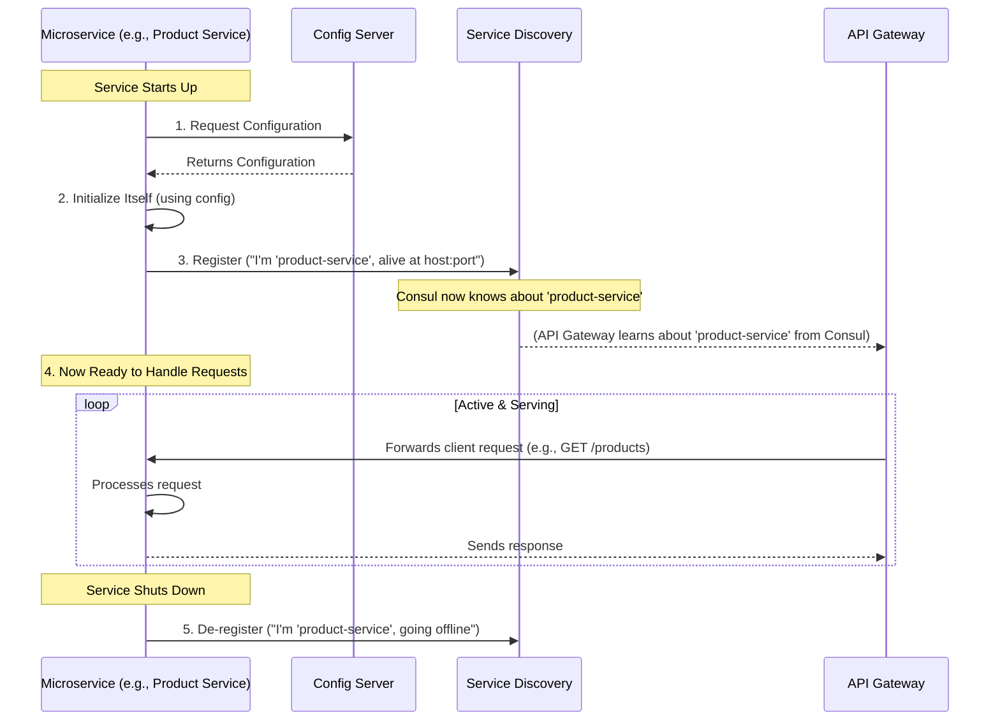

# Chapter 3: Microservice Core Structure & Lifecycle

Welcome back! In [Chapter 2: API Gateway & Dynamic Routing](02_api_gateway___dynamic_routing_.md), we learned how our e-commerce application's "main receptionist" (the API Gateway) smartly directs customer requests to the correct "department." But what exactly *are* these departments? How are they built, and how do they operate on a day-to-day basis?

That's what this chapter is all about! We're going to look at the heart of our system: the individual microservices like `user-service`, `product-service`, and `order-service`.

## What is a Microservice? The Specialized Department Analogy

Imagine a large e-commerce company. It wouldn't have just one giant office doing everything. Instead, it would have specialized departments:
*   **Human Resources (HR):** Manages employee (user) information. In our project, this is the `user-service`.
*   **Inventory Department:** Keeps track of all products, their details, and stock levels. This is our `product-service`.
*   **Sales Department:** Handles customer orders. This is our `order-service`.

Each of these "departments" (microservices) in our e-commerce platform is:
*   **Independent:** It focuses on its own specific area of business. The `product-service` doesn't need to know the details of how user accounts are managed, and the `user-service` doesn't care about product stock.
*   **Self-Contained:** It has its own tools and resources (code, and often its own data storage) to do its job.
*   **Responsible:** It manages its own tasks from start to finish.

This separation is key. It means we can build, update, or even fix one department without causing chaos in the others.

## Core Structure: Each Microservice is a Mini-Application

In our `E-Commerce-Microservice-master` project, each of these specialized departments – `user-service`, `product-service`, `order-service` – is actually a complete, runnable **Spring Boot application**.

Think of it like this: instead of one enormous software program, we have several smaller, focused programs that work together.

Let's look at the `ProductServiceApplication.java` file, which is the entry point for our `product-service`:

```java
// File: product-service/src/main/java/com/example/product/ProductServiceApplication.java
package com.example.product;

import org.springframework.boot.SpringApplication;
import org.springframework.boot.autoconfigure.SpringBootApplication; // (1)
import org.springframework.cloud.client.discovery.EnableDiscoveryClient; // (2)
// ... other imports like @EnableCaching, @EnableJpaAuditing

@SpringBootApplication // (1) I am a Spring Boot application!
@EnableDiscoveryClient // (2) I want to be discoverable by others!
// ... other annotations
public class ProductServiceApplication {

	public static void main(String[] args) { // (3) This is how you start me!
		SpringApplication.run(ProductServiceApplication.class, args);
	}
}
```

Let's break this down:
1.  **`@SpringBootApplication`**: This single annotation is like a magic wand in the Spring Boot world. It tells Java, "This isn't just any old program; it's a fully-featured Spring Boot application!" It bundles several other useful annotations that set up web servers, component scanning, and auto-configuration.
2.  **`@EnableDiscoveryClient`**: This annotation signals that this microservice wants to be "discoverable." As we'll see in its lifecycle, this means it will register itself with a service discovery tool (like Consul in our project), so other services (especially the [API Gateway](02_api_gateway___dynamic_routing_.md)) can find it.
3.  **`public static void main(String[] args)`**: This is the standard starting point for any Java application. When you want to run the `product-service`, this `main` method is what gets executed, and `SpringApplication.run(...)` kicks off the entire Spring Boot machinery for this microservice.

The `user-service` (`UserServiceApplication.java`) and `order-service` (`OrderServiceApplication.java`) have very similar structures, each with its own `@SpringBootApplication` annotation and `main` method. They are all independent Spring Boot applications, each tailored for its specific job.

```java
// File: user-service/src/main/java/com/example/user/UserServiceApplication.java
package com.example.user;

// ... imports ...
@SpringBootApplication
@EnableDiscoveryClient // Also wants to be discoverable
// ... other specific annotations like @EnableCaching, @EnableScheduling
public class UserServiceApplication {
	public static void main(String[] args) {
		SpringApplication.run(UserServiceApplication.class, args);
	}
}
```

```java
// File: order-service/src/main/java/com/example/order/OrderServiceApplication.java
package com.example.order;

// ... imports ...
@SpringBootApplication
@EnableDiscoveryClient // This one too!
@EnableFeignClients // We'll learn about this in Chapter 7!
// ... other specific annotations like @EnableJpaAuditing
public class OrderServiceApplication {
	public static void main(String[] args) {
		SpringApplication.run(OrderServiceApplication.class, args);
	}
}
```
Each service is a distinct application, running in its own process, ready to perform its specialized functions.

## The Microservice Lifecycle: From Startup to Serving Requests

Just like a department in a company has a daily routine, each microservice goes through a lifecycle:

1.  **Startup (Getting Ready for Work):**
    *   When a microservice (e.g., `product-service`) starts, the first thing it does is load its settings. Remember from [Chapter 1: Centralized Configuration Management](01_centralized_configuration_management_.md), it contacts the Config Server to get its specific configuration (like database details, port numbers, etc.).
    *   Based on this configuration, it initializes all its necessary components: setting up database connections, preparing caches, etc.

2.  **Registration (Checking In):**
    *   Once it's initialized, the microservice needs to let the rest of the system know it's available. This is where the `@EnableDiscoveryClient` annotation comes into play.
    *   The service contacts the **Service Discovery** tool (Consul in our project) and registers itself. It essentially says, "Hi, I'm `product-service`, and I'm ready to handle requests at this network address (e.g., `192.168.1.5:8081`)."
    *   This registration is crucial because it allows the [API Gateway](02_api_gateway___dynamic_routing_.md) to know where to send product-related requests.

3.  **Handling Business (Doing Its Job):**
    *   Now, the microservice is up and running, registered, and waiting for work.
    *   When the API Gateway forwards a request (e.g., "get all products" or "get details for product ID 123") to it, the microservice processes that request.
    *   This involves executing its specific business logic, perhaps fetching data from its database (we'll see more on this in [Chapter 5: Domain Entities & Repository Pattern](05_domain_entities___repository_pattern_.md)), and preparing a response.
    *   Sometimes, to fulfill a request, a microservice might need to talk to another microservice. For example, when creating an order, the `order-service` might need to check product availability with the `product-service`. We'll explore this in [Chapter 7: Inter-Service Communication (Feign Clients)](07_inter_service_communication__feign_clients__.md).

4.  **Shutdown (Going Home):**
    *   When a microservice is shut down (either manually or due to an update or scaling down), it should ideally de-register itself from the Service Discovery (Consul).
    *   This tells Consul, "I'm `product-service`, and I'm no longer available at that address." This prevents the API Gateway from sending requests to a service that's no longer there.

## Visualizing the Lifecycle

Let's see this lifecycle in a simple diagram:


This flow shows how a microservice becomes an active, contributing part of the overall e-commerce platform.

## Key Configuration Files for an Individual Microservice

Apart from its Java code, each microservice also relies on its own `application.yml` (or `bootstrap.yml`) file for initial instructions. Let's look at a snippet from `product-service/src/main/resources/application.yml` (though in our project, much of this is in `bootstrap.yml` which is read even earlier):

```yaml
# This is typically in bootstrap.yml for config client setup
# File: product-service/src/main/resources/bootstrap.yml (conceptual)
spring:
  application:
    name: product-service # (1) My name is 'product-service'
  config:
    import: optional:configserver:http://localhost:1000 # (2) Get more settings from here!
  cloud:
    consul:
      host: localhost # (3) Where to find Consul
      port: 8500
      discovery:
        service-name: ${spring.application.name} # Register with Consul using my name
        # Other consul settings like metadata for basePath...
```
1.  **`spring.application.name: product-service`**: This is critically important.
    *   It tells the [Config Server](01_centralized_configuration_management_.md) which service-specific configuration to provide.
    *   It's also the name under which the service will register with Consul (Service Discovery).
2.  **`spring.config.import: optional:configserver:http://localhost:1000`**: As seen in Chapter 1, this tells the service where to fetch its main configuration from.
3.  **`spring.cloud.consul...`**: These settings tell the microservice how to find and interact with Consul for service registration and discovery.

These initial settings allow the microservice to "boot up," find its full configuration, and then announce its presence to the rest of the system.

## Benefits of This Independent Structure & Lifecycle

Why go to all this trouble of having many small, independent applications?

*   **Independence in Development & Deployment:**
    *   Different teams can work on different services (e.g., `user-service`, `product-service`) simultaneously without stepping on each other's toes.
    *   You can update or fix the `product-service` and redeploy *only* that service. The `user-service` and `order-service` can continue running undisturbed. This makes updates faster and less risky.

*   **Scalability:**
    *   If your website gets a huge surge of traffic for browsing products, you can scale up *only* the `product-service` by running more instances of it. You don't need to scale up the `user-service` if user registration isn't seeing the same load. This is efficient resource usage.

*   **Modularity & Maintainability:**
    *   Each service has a clear, well-defined responsibility. This makes the codebase for each service smaller and easier to understand, test, and maintain.

*   **Resilience (Fault Isolation):**
    *   If one microservice (say, a less critical `recommendation-service`) encounters an error and crashes, it doesn't necessarily bring down the entire e-commerce platform. Customers might still be able to browse products, manage their accounts, and place orders if the `product-service`, `user-service`, and `order-service` are running fine.

## Conclusion

You've now seen that each core business function in our `E-Commerce-Microservice-master` project (like managing users, products, or orders) is handled by its own dedicated Spring Boot application. These microservices are like specialized departments in a company: they have a clear structure, manage their own tasks, and follow a defined lifecycle from starting up and registering their availability, to handling business, and finally shutting down.

This approach of building small, independent, and focused services is fundamental to the microservices architecture, allowing for greater flexibility, scalability, and easier maintenance.

Now that we understand how these services are structured, how they start, and how requests reach them via the API Gateway, a very important question arises: How do we ensure that only authorized users or services can access their functionalities? That's the topic of our next chapter: [JWT-Based Security & Token Validation](04_jwt_based_security___token_validation_.md).

---

Generated by [AI Codebase Knowledge Builder](https://github.com/The-Pocket/Tutorial-Codebase-Knowledge)