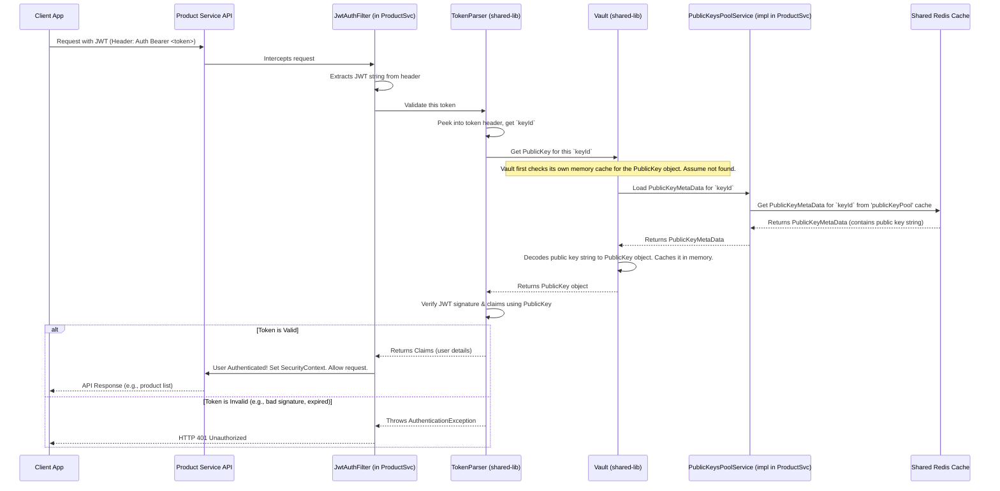

# Chapter 4: JWT-Based Security & Token Validation

Welcome back! In [Chapter 3: Microservice Core Structure & Lifecycle](03_microservice_core_structure___lifecycle_.md), we saw how our individual microservices like `product-service` and `user-service` operate as independent applications. Now, a crucial question arises: If anyone can send requests to these services through the [API Gateway](02_api_gateway___dynamic_routing_.md), how do we make sure that sensitive actions (like viewing your order history or updating your profile) are only performed by the *actual* logged-in user? How do we secure our shop?

This chapter is all about keeping our e-commerce platform safe using a modern security mechanism: **JSON Web Tokens (JWTs)**.

## The Problem: Who Are You, Really?

Imagine you want to check your past orders on our e-commerce site. You'd navigate to a "My Orders" page. When your browser asks the `order-service` for this information, how does the `order-service` know it's *you* and not someone else trying to peek at your private data?

We need a way for users to prove their identity with every request they make to protected parts of our application. This is where JWT-based security comes in.

## What is a JWT? Your Digital ID Card

Think of a **JSON Web Token (JWT)** as a **digital ID card**.

*   **Issuance:** When you successfully log into our e-commerce application (by providing your username and password to the `user-service`), the `user-service` acts like an official ID card office. It verifies who you are and then issues you a JWT.
*   **Content (Claims):** This digital ID card (JWT) isn't empty. It contains important pieces of information about you, like your user ID, your role (e.g., "customer" or "admin"), and when the ID card expires. These pieces of information are called "claims."
*   **Tamper-Proof (Signature):** Crucially, this digital ID card is securely "signed" by the `user-service` using a secret key (a private key). This signature ensures that the ID card is authentic and hasn't been faked or altered by anyone else.
*   **Compact & Portable:** JWTs are designed to be small and easy to send along with web requests.

Once you have this JWT, your browser (or mobile app) will show this "digital ID card" every time it needs to access a protected resource, like asking the `order-service` for your orders.

## The Big Picture: Security in Our E-Commerce App

Here's how JWTs help secure our system:

1.  **Login & Token Issuance (`user-service`):**
    *   You visit the login page and enter your credentials.
    *   These are sent to the `user-service`.
    *   The `user-service` checks your username and password.
    *   If they are correct, it generates a JWT (your digital ID card) and sends it back to your browser.
    *   This JWT is signed using a **private key** that only the `user-service` knows.
    *   The `user-service` also makes the corresponding **public key** available (via a shared cache like Redis) so other services can verify the ID cards it issues.

2.  **Client Stores and Sends Token:**
    *   Your browser receives the JWT and stores it securely (often in local storage or a cookie).
    *   For any subsequent request to a protected part of our shop (e.g., fetching products, placing an order), your browser automatically includes this JWT in a special part of the request called the `Authorization` header. It's like saying, "Here's my ID card."

3.  **Token Validation (Other Services like `product-service`, `order-service`):**
    *   When the `product-service` or `order-service` receives a request, it looks for this JWT in the `Authorization` header.
    *   It then needs to check if this "ID card" is genuine and valid. This is called **token validation**.
    *   Our services (`product-service`, `order-service`, etc.) use a shared piece of code, the `shared-token-validation-lib`, to perform this check.
    *   This library:
        *   Reads the JWT.
        *   Finds out which public key is needed to verify it (the JWT header contains a hint – a public key identifier).
        *   Fetches that specific public key (usually from the shared Redis cache where the `user-service` put it).
        *   Uses the public key to verify the JWT's signature. If the signature is valid, it means the JWT is authentic (issued by our `user-service`) and hasn't been tampered with.
        *   It also checks if the token has expired.
    *   If the JWT is valid, the service trusts the information in it (like your user ID) and processes the request.
    *   If the JWT is invalid (e.g., bad signature, expired, or missing), the service denies the request (usually with an "Unauthorized" error).

This ensures that only users with valid, unexpired "digital ID cards" issued by our trusted `user-service` can access protected resources.

## Step 1: Generating the "Digital ID Card" (User Service)

The `user-service` is responsible for creating these JWTs. This involves two main parts: managing the signing keys and generating the token itself.

### Managing Signing Keys (`SecretManager.java` in `user-service`)

To sign JWTs securely, the `user-service` uses a pair of cryptographic keys: a **private key** (kept secret) and a **public key** (shared with others).
*   The **private key** is used to *sign* the JWTs. Only the `user-service` has it.
*   The **public key** is used to *verify* the signature. Other services will use this.

Our `user-service` has a `SecretManager` that handles these keys:

```java
// Simplified from: user-service/src/main/java/com/example/user/security/jwt/secret/SecretManager.java
package com.example.user.security.jwt.secret;
// ... imports ...

@Component
@Slf4j
@AllArgsConstructor
public class SecretManager {

    private final IssuerVault issuerVault; // Securely stores the private key
    private final CacheManager cacheManager; // To access shared Redis cache

    // This method runs automatically at startup and then regularly
    @Scheduled(initialDelay = 0, fixedDelayString = "${app.security.secret-rotate-interval-millis}")
    public void rotateKeyPair() throws Exception {
        log.info("Generating new set of signing keys...");
        // 1. Create a new pair of private and public keys
        KeyPair keyPair = generateNewRsaKeyPair(); // Fancy math to make secure keys
        PublicKey publicKey = keyPair.getPublic();
        PrivateKey privateKey = keyPair.getPrivate();

        // Convert public key to a text format to store it
        String publicKeyString = Base64.getEncoder().encodeToString(publicKey.getEncoded());
        String uniqueKeyId = UUID.randomUUID().toString(); // A unique ID for this public key

        // 2. Publish the public key so other services can find it
        // We store it in a shared cache (Redis) that all services can access.
        PublicKeyMetaData publicKeyData = PublicKeyMetaData.builder()
                .id(uniqueKeyId)
                .publicKey(publicKeyString)
                .generateAt(System.currentTimeMillis())
                .build();

        Cache publicKeyCache = cacheManager.getCache(CacheName.PUBLIC_KEY_POOL);
        if (publicKeyCache != null) {
            publicKeyCache.put(uniqueKeyId, publicKeyData); // Store public key in Redis
            log.info("New public key {} published to cache.", uniqueKeyId);
        }

        // 3. Securely store the new private key for the User Service to use for signing
        // And tell the IssuerVault which public key ID corresponds to this private key
        issuerVault.setNewPrivateKey(privateKey, uniqueKeyId);
        issuerVault.currentPublicKeyIdentifier(uniqueKeyId); // Mark this key as the one to use now
    }

    private static KeyPair generateNewRsaKeyPair() throws NoSuchAlgorithmException {
        // Standard Java way to generate RSA keys
        KeyPairGenerator generator = KeyPairGenerator.getInstance("RSA");
        generator.initialize(2048); // Key size
        return generator.generateKeyPair();
    }
}
```
*   **Key Rotation:** The `rotateKeyPair` method periodically generates a fresh pair of private and public keys. This is a good security practice.
*   **Publishing Public Key:** The new public key, along with a unique `keyId`, is published to a shared cache (Redis, identified by `CacheName.PUBLIC_KEY_POOL`). Other microservices will fetch it from here to verify tokens.
*   **Storing Private Key:** The corresponding private key is stored securely within the `user-service` (using `IssuerVault`) to sign new JWTs.

### Creating the JWT (`TokenGenerator.java` in `user-service`)

When a user successfully logs in, the `TokenGenerator` creates the JWT:

```java
// Simplified from: user-service/src/main/java/com/example/user/security/jwt/TokenGenerator.java
package com.example.user.security.jwt;
// ... imports ...

@Component
@Slf4j
@AllArgsConstructor
public class TokenGenerator {

    private final IssuerVault issuerVault; // Gets the current private key and its ID

    public String generateToken(Map<String, Object> userClaims, Date issuedAt, Date expirationTime) {
        try {
            // 1. Get the current private key and the ID of its corresponding public key
            PrivateKey currentPrivateKey = issuerVault.getPrivateKey();
            String currentPublicKeyId = issuerVault.getCurrentPublicKeyId();

            // 2. Build the JWT
            String token = Jwts.builder()
                    // Header: Include the public key ID.
                    // This tells verifiers which public key to use.
                    .setHeaderParam(ClaimNames.PUB_KEY_ID, currentPublicKeyId)
                    // Payload: User-specific info (like user ID, roles)
                    .setClaims(userClaims)
                    .setIssuedAt(issuedAt) // When the token was made
                    .setExpiration(expirationTime) // When the token is no longer valid
                    // Signature: Sign with our private key using RS256 algorithm
                    .signWith(currentPrivateKey, SignatureAlgorithm.RS256)
                    .compact(); // Makes it a compact string

            log.info("JWT generated successfully using public key ID: {}", currentPublicKeyId);
            return token;
        } catch (Exception e) {
            log.error("Error generating JWT: {}", e.getMessage());
            throw new RuntimeException("Token generation failed", e);
        }
    }
}
```
*   **`issuerVault`**: Provides the current private key for signing and the `keyId` of the public key that verifiers should use.
*   **`setHeaderParam(ClaimNames.PUB_KEY_ID, currentPublicKeyId)`**: This is important! It embeds the `keyId` into the JWT's header. When another service receives this JWT, it will look at this `keyId` to know which public key it needs to fetch for verification.
*   **`.setClaims(userClaims)`**: This puts the user's information (e.g., user ID, username, roles) into the JWT.
*   **`.signWith(...)`**: This digitally signs the token using the `user-service`'s private key.

The user now has their "digital ID card" (JWT).

## Step 2: Verifying the "Digital ID Card" (e.g., Product Service)

When the user tries to access a protected resource, say, view products, their browser sends the JWT to the `product-service`. The `product-service` must now verify this JWT. It uses the `shared-token-validation-lib` for this.

### Setting up the Security Check (`SecurityConfig.java` in `product-service`)

The `product-service` (and other services like `order-service`) configures Spring Security to use a special filter that understands JWTs. This filter comes from our `shared-token-validation-lib`.

```java
// Simplified from: product-service/src/main/java/com/example/product/security/SecurityConfig.java
package com.example.product.security;
// ... imports from shared-token-validation-lib ...

@Configuration
@EnableWebSecurity
@AllArgsConstructor
public class SecurityConfig {

    private final FilterFactory filterFactory; // From shared-token-validation-lib

    // ... other beans like PasswordEncoder ...

    @Bean
    SecurityFilterChain securityFilterChain(HttpSecurity http) throws Exception {
        return http
                .csrf(AbstractHttpConfigurer::disable) // Disable CSRF for stateless APIs
                .authorizeHttpRequests(auth -> auth
                        // Allow anyone to GET product information (e.g. /api/products/all)
                        .requestMatchers(HttpMethod.GET, "/api/**").permitAll()
                        // Any other request needs to be authenticated
                        .anyRequest().authenticated())
                .sessionManagement(session -> session
                        .sessionCreationPolicy(SessionCreationPolicy.STATELESS)) // No server-side sessions

                // Add our custom JWT authentication filter before Spring's default username/password filter
                .addFilterBefore(
                        filterFactory.createJwtFilter(JwtAuthFilter.class, TokenType.ACCESS),
                        UsernamePasswordAuthenticationFilter.class)
                .build();
    }
}
```
*   **`FilterFactory`**: This component from `shared-token-validation-lib` is used to create our `JwtAuthFilter`.
*   **`addFilterBefore(...)`**: This tells Spring Security: "Before you do your usual authentication, run our `JwtAuthFilter`." This filter will look for a JWT and try to authenticate the user based on it.
*   **`SessionCreationPolicy.STATELESS`**: This is key for JWTs. It means the server doesn't keep track of user sessions. Each request must carry its own proof of identity (the JWT).

### How the `shared-token-validation-lib` Works

The real magic of validation happens inside the `shared-token-validation-lib`. Let's look at the main players:

1.  **`JwtAuthFilter`**: This filter (created by `FilterFactory`) is the entry point.
    *   It extracts the JWT string from the `Authorization: Bearer <token>` header of the incoming request.
    *   If a token is found, it passes it to an `Authenticator` for the actual validation logic.

2.  **`Authenticator`**: This class orchestrates the authentication. It uses a `TokenParser`.

3.  **`TokenParser`**: This is the workhorse for parsing and validating the JWT.
    ```java
    // Simplified from: shared-token-validation-lib/src/main/java/com/rajugowda/jwt/validator/auth/TokenParser.java
    package com.rajugowda.jwt.validator.auth;
    // ... imports ...

    @Component
    @AllArgsConstructor
    @Slf4j
    public class TokenParser {

        private final Vault vault; // Helps get the correct public key

        public Claims parseToken(String token) {
            if (token == null) {
                throw new IllegalArgumentException("Token cannot be null");
            }
            log.info("Attempting to parse token...");

            // 1. Extract the Public Key ID from the token's header
            // This ID tells us which public key was used to sign this token.
            final String publicKeyId = extractPublicKeyIdFromHeader(token);
            log.debug("Extracted public key ID from token: {}", publicKeyId);

            // 2. Get the actual Public Key object using the ID
            // The Vault will try to find it (e.g., from a cache or by fetching it).
            final PublicKey publicKey = vault.getPublicKey(publicKeyId);
            if (publicKey == null) {
                log.warn("Public key not found for ID: {}. Cannot validate token.", publicKeyId);
                throw new PublicKeyForTokenNotFoundException("Public key not found for token's key ID.");
            }

            // 3. Parse and VERIFY the token using the fetched public key
            // This checks the signature, expiry time, and other standard JWT rules.
            try {
                return Jwts.parserBuilder()
                        .setSigningKey(publicKey) // Use the specific public key
                        .build()
                        .parseClaimsJws(token) // This throws an exception if invalid
                        .getBody(); // If valid, get the claims (user info)
            } catch (ExpiredJwtException e) {
                log.warn("Token expired: {}", e.getMessage());
                throw new InvalidJwtException("Token expired", e);
            } catch (JwtException e) { // Catches other JWT issues like malformed, signature error
                log.warn("Invalid JWT: {}", e.getMessage());
                throw new InvalidJwtException("Invalid token", e);
            }
        }

        // Helper to get the keyId from JWT header (simplified)
        private String extractPublicKeyIdFromHeader(String token) {
            // ... (logic to decode JWT header and get ClaimNames.PUB_KEY_ID) ...
            // For example, it splits the token, Base64 decodes the header part,
            // parses the JSON in the header, and retrieves the value of "kid" (or PUB_KEY_ID).
            // This is a simplified representation. The actual code is more robust.
            String[] parts = token.split("\\.");
            if (parts.length < 2) throw new InvalidJwtException("Invalid JWT format");
            String decodedHeader = new String(Base64.getUrlDecoder().decode(parts[0]));
            // In a real scenario, parse JSON properly:
            // ObjectMapper mapper = new ObjectMapper();
            // Map<String, Object> headerMap = mapper.readValue(decodedHeader, new TypeReference<>() {});
            // return (String) headerMap.get(ClaimNames.PUB_KEY_ID);
            // For this example, let's assume a simple parse:
            if (decodedHeader.contains("\"" + ClaimNames.PUB_KEY_ID + "\":\"")) {
                // Very basic parsing for illustration
                return decodedHeader.split("\"" + ClaimNames.PUB_KEY_ID + "\":\"")[1].split("\"")[0];
            }
            throw new InvalidPublicKeyIdentifierException("Public Key ID not found in token header");
        }
    }
    ```
    *   **`extractPublicKeyIdFromHeader(token)`**: It first peeks into the JWT's header to find the `PUB_KEY_ID` (the hint about which public key to use).
    *   **`vault.getPublicKey(publicKeyId)`**: It then asks the `Vault` for the actual `PublicKey` object corresponding to that `keyId`.
    *   **`Jwts.parserBuilder()...parseClaimsJws(token)`**: This is where the core validation happens using the `jjwt` library. It verifies the token's signature against the provided `publicKey`. It also checks if the token has expired or if it's malformed. If anything is wrong, it throws an exception.
    *   If successful, it returns the `Claims` (the user information embedded in the JWT).

4.  **`Vault` and `PublicKeysPoolService`**: How does the `Vault` get the public key?
    *   The `Vault` (from `shared-token-validation-lib`) is responsible for providing `PublicKey` objects.
    *   It uses an interface called `PublicKeysPoolService`. Each service (like `product-service`) must provide an implementation of this interface, telling the `Vault` how to fetch public key *metadata* (which includes the public key as a string).
    *   In our `product-service`, this implementation is in `ValidationLibConfig.java`:

    ```java
    // Simplified from: product-service/src/main/java/com/example/product/security/ValidationLibConfig.java
    package com.example.product.security;
    // ... imports ...

    @Configuration
    @Slf4j
    public class ValidationLibConfig {

        // This bean provides the logic for the shared Vault to find public key data
        @Bean
        PublicKeysPoolService publicKeyDataProvider(CacheManager cacheManager) {
            // Get a handle to our shared Redis cache where user-service puts public keys
            var publicKeyRedisCache = cacheManager.getCache(CacheName.PUBLIC_KEY_POOL);

            // This is the function that Vault will call when it needs a public key's data
            return keyIdFromJwt -> { // keyIdFromJwt is the ID extracted from the token's header
                if (publicKeyRedisCache == null) {
                    log.warn("Public key cache '{}' not found.", CacheName.PUBLIC_KEY_POOL);
                    return null; // No cache, can't find key
                }

                // Try to get the PublicKeyMetaData (which contains the key string) from Redis
                PublicKeyMetaData keyDataFromCache = publicKeyRedisCache.get(keyIdFromJwt, PublicKeyMetaData.class);

                if (keyDataFromCache != null) {
                    log.info("Found public key data in Redis cache for ID: {}", keyIdFromJwt);
                } else {
                    log.warn("Public key data NOT found in Redis for ID: {}. Token validation might fail.", keyIdFromJwt);
                }
                return keyDataFromCache; // Return the data (or null if not found)
            };
        }
    }
    ```
    *   This implementation of `PublicKeysPoolService` simply looks up the `keyId` in the shared Redis cache (`CacheName.PUBLIC_KEY_POOL`). This is the same cache where the `user-service`'s `SecretManager` published the public key metadata earlier.
    *   Once the `Vault` gets the `PublicKeyMetaData` (containing the public key as a string), it converts this string into an actual `PublicKey` object and might cache it locally (in memory) for faster access next time.

If the `TokenParser` successfully validates the JWT, the `JwtAuthFilter` tells Spring Security that the user is authenticated. The request is then allowed to proceed to the actual API endpoint (e.g., the product controller method). Spring Security also makes the user's details (from the JWT claims) available to the application code if needed.

## The Validation Flow: Step-by-Step

Let's visualize how a token sent to the `product-service` gets validated:



This system ensures that:
*   Only tokens issued by our `user-service` are accepted.
*   Tokens cannot be tampered with.
*   Expired tokens are rejected.
*   The `user-service` can rotate its signing keys, and other services will automatically pick up the new public keys from the shared cache.

## Conclusion

You've just learned how our e-commerce application uses JSON Web Tokens (JWTs) to secure its APIs. It's like a system of digital ID cards:

*   The **`user-service`** acts as the ID office, issuing signed JWTs upon successful login. It manages the secret signing keys and publishes the public verification keys to a shared cache (Redis).
*   Clients (like your browser) send this JWT with every request to protected services.
*   Other services (like `product-service` and `order-service`) use a **`shared-token-validation-lib`** to validate these JWTs. This library fetches the correct public key from the shared cache (using the `keyId` from the JWT header) and verifies the token's authenticity and integrity.

This JWT-based approach provides robust, stateless, and scalable security for our microservices. It ensures that only authenticated users can access the resources they are permitted to.

Now that we understand how services are secured, we can look closer at what happens *inside* these services. How do they manage their specific data, like product details or order information? That's what we'll explore in the next chapter: [Domain Entities & Repository Pattern](05_domain_entities___repository_pattern_.md).

---

