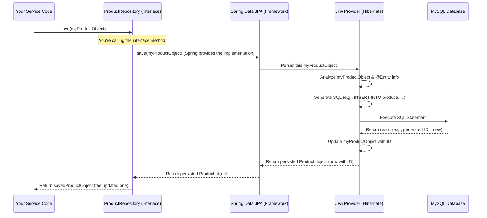

# Chapter 5: Domain Entities & Repository Pattern

Welcome back! In [Chapter 4: JWT-Based Security & Token Validation](04_jwt_based_security___token_validation_.md), we learned how our e-commerce application keeps things secure by making sure only authorized users can access sensitive information or perform actions. We saw how services like `product-service` check a "digital ID card" (JWT) before doing their job. Now, let's look at what happens *inside* these services when they need to work with their specific data, like product details or customer order information.

## Why Do We Need This? Managing Service-Specific Data

Imagine our `product-service`. Its main job is to manage all things related to products: their names, descriptions, prices, how many are in stock, and so on.
*   When a new shipment of "Super Comfy T-Shirts" arrives, the `product-service` needs to **store** this new product's information.
*   When a customer browses the website and clicks on the "Super Comfy T-Shirt," the `product-service` needs to **fetch** its details to display on the page.
*   When a customer buys a t-shirt, the `product-service` needs to **update** the stock count for that t-shirt.

Where does all this product information live? How does the `product-service` read and write it reliably and efficiently? And, importantly, how can we do this without mixing complicated database code directly into our main business rules (like how to calculate a discount or check stock levels)?

This is where **Domain Entities** and the **Repository Pattern** come to the rescue. They help us neatly organize and manage the data that each microservice is responsible for.

## Key Concepts: Entities and Repositories

Let's break down these two important ideas.

### 1. Domain Entities: The "Nouns" of Your Service

Think of your microservice as if it's telling a story about its specific job. The **Domain Entities** would be the main characters or important objects in that story – essentially, the key **nouns**.

*   For our `product-service`, the most important noun is obviously `Product`.
*   A `Product` Domain Entity is a Java class that represents a single product in our e-commerce system. It's like a digital blueprint holding all the information for one product: its unique `id`, `title` (e.g., "Super Comfy T-Shirt"), `description`, `price`, current `stock` level, and so on.

These entities are typically plain Java classes that mirror the core business concepts. They are the heart of the service's understanding of its world.

Here's a simplified look at what our `Product` entity might look like in Java:

```java
// Simplified from: product-service/src/main/java/com/example/product/domain/model/Product.java
package com.example.product.domain.model;

import jakarta.persistence.Entity; // Tells Java this class maps to a database table
import jakarta.persistence.Id;     // Marks a field as the unique identifier
import jakarta.persistence.GeneratedValue; // For auto-generated IDs
// ... other necessary imports ...

@Entity // (1) This class is a "Domain Entity" that can be stored.
public class Product {

    @Id // (2) This 'id' field is the unique key for a product.
    @GeneratedValue // (3) The database will generate this ID automatically.
    private Long id;

    private String title;
    private String description;
    private double price;
    private int stock;
    // ... other fields like category, createdAt, sellerId ...

    // Constructors, getters, and setters are usually here.
    // (In our project, Lombok library annotations like @Getter, @Setter, @Builder
    // generate these automatically for less code clutter!)
}
```
Let's understand those annotations:
1.  `@Entity`: This is an annotation from Jakarta Persistence API (JPA). It's like a label telling the system, "This `Product` class isn't just any Java class; it represents something real that we need to store in a database (like a row in a `products` table)."
2.  `@Id`: This marks the `id` field as the primary key for the `Product`. Every product will have a unique `id`.
3.  `@GeneratedValue`: This tells JPA that the `id` for a new product will be generated automatically, usually by the database itself (e.g., as an auto-incrementing number).

### 2. Repository Pattern: The "Librarian" for Your Data

If Domain Entities (like `Product`) are the "books" containing information, then a **Repository** is like the helpful "librarian" for those books.

*   You don't go rummaging through all the database shelves yourself to find or store a `Product`. Instead, you ask the `ProductRepository` (our librarian) to do it for you.
*   The Repository pattern provides a clean and consistent way to access and manage your Domain Entities. It offers simple, understandable methods like `save(aNewProduct)`, `findById(someProductId)`, `findAllProducts()`, or `deleteProduct(aProduct)`.
*   Crucially, the Repository **hides the complicated details** of how data is actually stored and retrieved. Your business logic doesn't need to know if the data is in a MySQL database, a different kind of database, or even just a simple list during testing. It just talks to the "librarian."

In our project, we use Spring Data JPA, which makes creating repositories incredibly easy. We just define an interface:

```java
// Simplified from: product-service/src/main/java/com/example/product/domain/repository/ProductRepository.java
package com.example.product.domain.repository;

import com.example.product.domain.model.Product;
import org.springframework.data.jpa.repository.JpaRepository; // Spring Data JPA magic!

// This interface IS our "librarian" (Repository) for Product entities.
public interface ProductRepository extends JpaRepository<Product, Long> { // (1)

    // (2) Because we extend JpaRepository, we automatically get methods like:
    // - Product save(Product productToSave); // Saves a new product or updates an existing one
    // - Optional<Product> findById(Long productId); // Finds a product by its ID
    // - List<Product> findAll(); // Gets all products
    // - void deleteById(Long productId); // Deletes a product
    // - ...and many more! We don't have to write the code for these!

    // (3) We can also add our own custom methods if needed.
    // For example, this one checks if a product exists and has enough stock:
    boolean existsByIdAndStockGreaterThanEqual(Long id, int quantity);
}
```
Let's look at the key parts:
1.  `extends JpaRepository<Product, Long>`: This is where the Spring Data JPA magic happens!
    *   `Product`: Tells Spring Data JPA that this repository works with `Product` entities.
    *   `Long`: Tells it that the `id` (primary key) of our `Product` entity is of type `Long`.
2.  **Automatic Methods**: Just by extending `JpaRepository`, our `ProductRepository` interface instantly gets a whole suite of common database operations (Create, Read, Update, Delete - often called CRUD operations) without us writing a single line of implementation code for them!
3.  **Custom Methods**: We can also define our own methods, like `existsByIdAndStockGreaterThanEqual`. If we follow certain naming conventions, Spring Data JPA can often figure out the database query for these too!

## How It Solves Our Use Case: Working with Products

Let's see how these two concepts work together in the `product-service`.

**Scenario 1: Adding a New Product**

1.  Some part of our `product-service` (perhaps a "service layer" class that handles business logic, which we'll touch on more later) decides a new product needs to be added. It creates a `Product` object:
    ```java
    // Inside some business logic code in product-service...
    Product newTShirt = new Product();
    newTShirt.setTitle("Super Comfy T-Shirt - Blue");
    newTShirt.setDescription("A t-shirt so comfy, you'll never want to take it off!");
    newTShirt.setPrice(29.99);
    newTShirt.setStock(100);
    newTShirt.setCategory("Apparel");
    // newTShirt.setId(null); // ID is null because it's new, database will assign it
    ```

2.  Then, it asks our `ProductRepository` (the "librarian") to save this new product:
    ```java
    // Assume 'productRepository' is an instance of ProductRepository
    // (Spring Boot is smart and "injects" or provides this instance for us)

    Product savedTShirt = productRepository.save(newTShirt);

    // What happens?
    // - The 'productRepository.save()' method takes our 'newTShirt' object.
    // - Behind the scenes, it figures out the correct SQL 'INSERT' command.
    // - It sends this command to our MySQL database.
    // - The database stores the product information and assigns it a unique ID.
    // - The 'save()' method returns the Product object, now updated with the new ID!

    System.out.println("New t-shirt saved with ID: " + savedTShirt.getId());
    // Output might be: New t-shirt saved with ID: 123
    ```

**Scenario 2: Finding a Product by its ID**

1.  Let's say we want to find the product with ID `123`.
    ```java
    // Inside some business logic code...
    Long productIdToFind = 123L; // The L means it's a Long number

    // Ask the librarian (repository) to find it
    Optional<Product> foundProductOptional = productRepository.findById(productIdToFind);

    // What happens?
    // - The 'productRepository.findById()' method takes the ID.
    // - It figures out the correct SQL 'SELECT' command (e.g., "SELECT * FROM products WHERE id = 123").
    // - It sends this to MySQL.
    // - If a product with ID 123 exists, the database sends back its data.
    // - The repository then creates a 'Product' object from this data.
    // - It returns this 'Product' object wrapped in an 'Optional'.
    //   (Optional is a Java feature to handle cases where the product might not exist)

    if (foundProductOptional.isPresent()) {
        Product product = foundProductOptional.get();
        System.out.println("Found product: " + product.getTitle() + ", Price: $" + product.getPrice());
        // Output might be: Found product: Super Comfy T-Shirt - Blue, Price: $29.99
    } else {
        System.out.println("Product with ID " + productIdToFind + " was not found.");
    }
    ```

See how clean that is? Our business logic just deals with `Product` objects and simple repository methods. It doesn't need to write any SQL!

## What's Under the Hood? A Quick Look

You might be wondering, "If I don't write the database code for `save()` or `findById()`, who does?"

**The Journey of Saving a Product (Simplified):**

When your service code calls `productRepository.save(myProductObject)`:

1.  **Your Service Logic:** You have your `Product` object ready in Java.
2.  **Repository Interface (`ProductRepository`):** You call the `save` method on this interface.
3.  **Spring Data JPA (The Magic Framework):** Spring Boot, using its Spring Data JPA module, is very clever. It sees that `ProductRepository` extends `JpaRepository`. Because of this, Spring Data JPA automatically *provides an actual implementation* for the `save` method (and all the other standard methods). You don't see this code, but it's there!
4.  **JPA Provider (Hibernate):** Spring Data JPA doesn't talk to the database directly. It uses a specialized tool called a JPA Provider. In our project (and most Spring Boot projects), this tool is **Hibernate**. Hibernate is an expert at Object-Relational Mapping (ORM) – translating between Java objects (like `Product`) and database tables/rows.
5.  **Mapping to SQL:** Hibernate looks at your `Product` entity (remember the `@Entity` and `@Column` annotations?) and figures out exactly how to translate your `Product` object into the correct SQL `INSERT` or `UPDATE` statement for the `products` table in your MySQL database.
6.  **Database Execution:** Hibernate sends this generated SQL command to the MySQL database, which then executes it.
7.  **Result & Update:** The database saves the data. If it's a brand new product, MySQL assigns it a unique ID. Hibernate gets this ID (and any other generated values) back and updates your original `myProductObject` with this new information. This updated object is what `save()` returns.

Let's visualize this flow:



### Diving Deeper into the Code Definitions

Let's re-examine the key parts of our `Product` entity and `ProductRepository` with this understanding.

**Domain Entity (`Product.java`) - The Blueprint for Data Storage**

This file is located at: `product-service/src/main/java/com/example/product/domain/model/Product.java`

```java
package com.example.product.domain.model;

import jakarta.persistence.*; // JPA annotations for database mapping
import lombok.*; // For reducing boilerplate code (getters, setters, etc.)
import org.springframework.data.annotation.CreatedDate; // For auditing
import org.springframework.data.jpa.domain.support.AuditingEntityListener; // For auditing
import java.time.LocalDate;

@Entity // (1) Marks this class as a JPA entity, representing a table.
@Table(name = "products") // (2) Explicitly names the database table "products".
@Getter @Setter @Builder // (Lombok) Auto-generates getter/setter methods and a builder.
@AllArgsConstructor @NoArgsConstructor // (Lombok) Auto-generates constructors.
@EntityListeners(AuditingEntityListener.class) // (3) Enables JPA auditing features.
public class Product {

    @Id // (4) Marks 'id' as the primary key for the 'products' table.
    @GeneratedValue(strategy = GenerationType.IDENTITY) // (5) DB auto-generates this ID.
    @Column(name = "id", nullable = false, updatable = false)
    private Long id;

    @Column(name = "title") // Maps to 'title' column in the DB.
    private String title;

    @Column(name = "description", length = 2000) // Can specify column details.
    private String description;

    @Column(name = "price")
    private double price;

    // ... other fields like stock, category ...

    @CreatedDate // (6) From Spring Data JPA Auditing.
    @Column(name = "created_at", nullable = false, updatable = false)
    private LocalDate createdAt; // Automatically set when product is first saved.

    // ... other fields like updatedAt, sellerId ...
}
```
Key points to remember:
1.  `@Entity`: The most fundamental annotation, telling JPA "this class is a table."
2.  `@Table(name = "products")`: Links this class directly to the `products` database table.
3.  `@EntityListeners(AuditingEntityListener.class)`: Enables features like automatically setting creation/update timestamps.
4.  `@Id`: Designates the `id` field as the unique key for this table.
5.  `@GeneratedValue(strategy = GenerationType.IDENTITY)`: Instructs JPA that the database is responsible for generating the ID value when a new record is inserted (common for auto-increment columns).
6.  `@CreatedDate`: When auditing is enabled, Spring Data JPA will automatically populate this field with the current timestamp when a `Product` entity is first persisted (saved). Similar annotations like `@LastModifiedDate` exist for update timestamps.

**Repository (`ProductRepository.java`) - The Data Access Interface**

This file is at: `product-service/src/main/java/com/example/product/domain/repository/ProductRepository.java`

```java
package com.example.product.domain.repository;

import com.example.product.domain.model.Product;
import org.springframework.data.jpa.repository.JpaRepository; // (1) The core Spring Data JPA interface.

// This interface is our contract for interacting with Product data.
public interface ProductRepository extends JpaRepository<Product, Long> { // (2)

    // (3) Standard CRUD methods are INHERITED from JpaRepository:
    // - save(Product product)
    // - findById(Long id) -> returns Optional<Product>
    // - findAll() -> returns List<Product>
    // - delete(Product product)
    // - deleteById(Long id)
    // - count() -> returns long
    // - existsById(Long id) -> returns boolean
    // ... and more!

    // (4) Custom query method example (from the project code):
    // Spring Data JPA generates the query based on the method name!
    // This method checks if a product with 'id' exists AND its 'stock'
    // is greater than or equal to the provided 'quantity'.
    boolean existsByIdAndStockGreaterThanEqual(Long id, int quantity);
}
```
Key points to remember:
1.  `JpaRepository`: This is the star interface from Spring Data JPA that provides all the basic database operations.
2.  `extends JpaRepository<Product, Long>`: By doing this, `ProductRepository` inherits all the powerful methods. `Product` is the entity type it manages, and `Long` is the type of the entity's ID.
3.  **No Implementation Needed (for basics):** You don't write the actual Java/SQL code for `save()`, `findById()`, etc. Spring Data JPA generates it at runtime based on your entity and this interface.
4.  **Query Derivation from Method Names:** For more specific needs, you can define methods like `existsByIdAndStockGreaterThanEqual`. Spring Data JPA is smart enough to parse the method name and create the appropriate database query (e.g., `SELECT CASE WHEN COUNT(p) > 0 THEN TRUE ELSE FALSE END FROM Product p WHERE p.id = ?1 AND p.stock >= ?2`). This is a very powerful feature!

### The Same Pattern in Other Services

This powerful combination of Domain Entities and Repositories isn't unique to the `product-service`. You'll find it in our other microservices too:

*   **`order-service`**:
    *   **Domain Model**: `Order.java` (located at `order-service/src/main/java/com/example/order/domain/model/Order.java`) which represents a customer's order.
    *   **JPA Entity (for database mapping)**: `OrderEntity.java` (at `order-service/src/main/java/com/example/order/infrastructure/database/entities/OrderEntity.java`). This is the class with `@Entity` that maps to the `orders` table.
    *   **Repository Interface**: `OrderRepository.java` (at `order-service/src/main/java/com/example/order/domain/repository/OrderRepository.java`) is the application-level interface.
    *   **JPA Repository (Spring Data)**: `OrderJpaRepository.java` (at `order-service/src/main/java/com/example/order/infrastructure/database/repositories/OrderJpaRepository.java`) which extends `JpaRepository<OrderEntity, Long>`. The `OrderRepositoryAdapter.java` then uses this `OrderJpaRepository` to implement the `OrderRepository` interface, often with mapping between `Order` (domain) and `OrderEntity` (JPA).

*   **`user-service`**:
    *   **Domain Model**: `User.java` (at `user-service/src/main/java/com/example/user/domain/model/User.java`) represents a user of the platform.
    *   **JPA Entity (for database mapping)**: The project structure suggests a `UserEntity` class (though not explicitly shown in the provided snippet list as a separate file, it's implied by `UserEntityRepository` which handles `UserEntity`). This class would have the `@Entity` annotation and map to a `users` table.
    *   **Repository Interface**: `UserRepository.java` (at `user-service/src/main/java/com/example/user/application/repository/UserRepository.java`).
    *   **JPA Repository (Spring Data)**: `UserEntityRepository.java` (at `user-service/src/main/java/com/example/user/infrastructure/repository/UserEntityRepository.java`) which would extend `JpaRepository` for a `UserEntity`. The `UserRepositoryAdapter.java` uses this for actual data operations.

**The Big Benefit: Separation of Concerns!**
This separation is fantastic for good software design:
*   Your main **business logic** (e.g., in a `ProductService` class, which might use `ProductRepository`) focuses purely on the rules of your business (what defines a valid product, how to calculate prices, what happens when stock runs out). It doesn't get bogged down in writing SQL or managing database connections.
*   Your **Domain Entities** (`Product`, `Order`, `User`) clearly define the data structures your business cares about.
*   Your **Repositories** provide a clean, consistent API for data access, abstracting away the database details.

This makes your code:
*   **Cleaner and easier to read.**
*   **Easier to test.** (You can easily create "mock" or fake repositories for testing your business logic without needing a real database).
*   **More flexible.** (While a big change, if you ever needed to switch your database from MySQL to something else, most of your business logic wouldn't need to change, only the JPA configuration and perhaps some repository details).

## Conclusion

You've now explored two fundamental building blocks for managing data within our microservices: **Domain Entities** and the **Repository Pattern**.

*   **Domain Entities** (like `Product`, `Order`, `User`) are the core "nouns" or business objects that each microservice is built around. They are Java classes that represent these real-world concepts and their data.
*   The **Repository Pattern**, wonderfully simplified by Spring Data JPA's `JpaRepository`, gives us a clean, collection-like interface to save, find, update, and delete these entities. It acts as our helpful "librarian," managing the persistence of our domain objects without forcing us to write a lot of repetitive database access code.

This powerful combination helps us keep our business logic neatly separated from the nitty-gritty details of database interactions. This leads to microservices that are cleaner, more maintainable, and easier to test – all crucial qualities for building robust and scalable systems!

But when our services need to communicate with the outside world or with each other, they don't always pass around these full, rich Domain Entities. Often, they use simpler, more focused objects specifically designed for carrying data across boundaries. In the next chapter, we'll dive into [Data Transfer Objects (DTOs) & Mappers](06_data_transfer_objects__dtos____mappers_.md) to understand how and why this is done.

---
