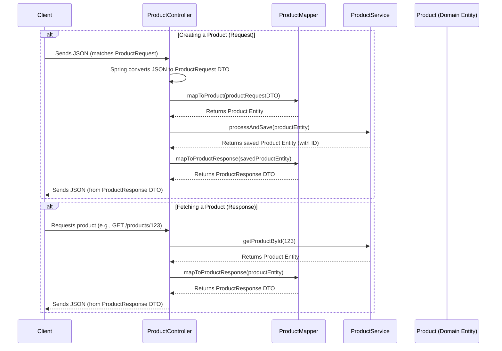

# Chapter 6: Data Transfer Objects (DTOs) & Mappers

Welcome back! In [Chapter 5: Domain Entities & Repository Pattern](05_domain_entities___repository_pattern_.md), we explored how our microservices use **Domain Entities** (like `Product` or `Order`) to represent their core data internally, and how **Repositories** help manage storing and retrieving these entities from the database. These entities are rich and detailed, perfect for internal business logic.

But what happens when our microservices need to talk to the outside world, like a customer's web browser or mobile app, or even to each other? Do we send these detailed internal entities directly? Often, the answer is no, for several good reasons!

## Why Do We Need Special "Forms" for Communication?

Imagine our `product-service`. Its internal `Product` entity might have many fields: `id`, `title`, `description`, `price`, `stock`, `internalCost`, `supplierInfo`, `lastStockedDate`, `createdByUser`, etc.

Now, consider these scenarios:

1.  **A Customer Views a Product:** Does the customer's browser need to know the `internalCost` or `supplierInfo`? Absolutely not! That's private business information.
2.  **An Admin Creates a New Product:** When an admin fills out a form to add a new product, they probably provide the `title`, `description`, `price`, and initial `stock`. They don't set the `id` (the database does that) or the `lastStockedDate` (that's an event).
3.  **API Changes:** What if we want to change our internal `Product` entity, perhaps by adding a new field for internal tracking? If our API directly used the `Product` entity, any such internal change could break the API for all our clients (web app, mobile app). We want our internal structure and our external "contract" (the API) to be somewhat independent.

This is where **Data Transfer Objects (DTOs)** and **Mappers** come into play. They act as structured "forms" or "messengers" specifically designed for communication.

## Key Concepts: DTOs and Mappers

Let's break down these two important ideas.

### 1. Data Transfer Objects (DTOs): The Structured Messengers

A **Data Transfer Object (DTO)** is a simple object whose main purpose is to carry data between different parts of your system, especially across service boundaries like API requests and responses.

Think of DTOs like specialized forms:
*   **Order Form (`ProductRequest`):** When a client (like a web admin panel) wants to create a new product, it doesn't send the entire complex `Product` entity. Instead, it sends a simpler `ProductRequest` DTO, which is like an "order form" containing only the necessary fields to create a product (e.g., `title`, `description`, `price`, `stock`).
*   **Display Card (`ProductResponse`):** When a client requests product information, the service doesn't send back its internal `Product` entity. Instead, it sends a `ProductResponse` DTO, which is like a "display card" or "brochure," containing only the fields safe and relevant for the client to see (e.g., `id`, `title`, `description`, `price`).

**Why use DTOs?**
*   **Decoupling:** The structure of your API (what clients send and receive) is separated from the structure of your internal Domain Entities. They can evolve independently.
*   **Data Hiding/Security:** You only expose the data that is necessary and safe. You can hide internal fields.
*   **Tailored Data:** You can create different DTOs for different situations. For a product list, you might have a `ProductSummaryDTO` with just `id`, `name`, and `price`.
*   **API Contract:** DTOs clearly define the "shape" of data your API expects and returns.

In our `product-service`, we have DTOs like:

**`ProductRequest.java` (The "Order Form" for creating/updating products):**
This is a Java `record`, which is a concise way to create classes that are simple data carriers.

```java
// File: product-service/src/main/java/com/example/product/application/dto/ProductRequest.java
package com.example.product.application.dto;

// This is what the API expects when someone wants to create or update a product.
public record ProductRequest(
        String title,
        String description,
        double price,
        int stock,
        String category
) {
    // No methods needed, just data fields!
}
```
*   This DTO clearly defines the data needed to create a new product. It doesn't include fields like `id` or `createdAt` because those are typically set by the system, not by the person making the request.

**`ProductResponse.java` (The "Display Card" for showing product details):**

```java
// File: product-service/src/main/java/com/example/product/application/dto/ProductResponse.java
package com.example.product.application.dto;

import java.time.LocalDate;

// This is what the API sends back when someone asks for product information.
public record ProductResponse(
        Long id,
        String title,
        String description,
        double price,
        int stock,
        String category,
        LocalDate createdAt,
        LocalDate updatedAt // Assuming 'updatedAt' is also part of your Product entity
) {
    // Again, just data fields.
}
```
*   This DTO defines what product information is sent back to the client. It includes system-generated fields like `id` and `createdAt` but might omit sensitive internal fields from the `Product` entity.

### 2. Mappers: The "Translators"

If we have internal `Product` entities and external `ProductRequest`/`ProductResponse` DTOs, we need a way to convert between them. This is the job of a **Mapper**.

Think of a Mapper as a "translator" or an efficient "conversion clerk":
*   When an "order form" (`ProductRequest`) arrives, the mapper translates it into a full internal "blueprint" (`Product` entity).
*   When the service needs to show a "display card" (`ProductResponse`), the mapper takes the internal "blueprint" (`Product` entity) and creates a neat `ProductResponse` from it.

Manually writing this conversion code (e.g., `product.setTitle(request.title()); product.setDescription(request.description()); ...`) can be tedious and error-prone, especially if you have many fields.

This is where tools like **MapStruct** shine. MapStruct is a code generator that automates the creation of these mapper implementations. You just define an interface with mapping methods, and MapStruct writes the actual conversion code for you during compilation!

Here's our `ProductMapper` interface using MapStruct:

```java
// File: product-service/src/main/java/com/example/product/application/mapper/ProductMapper.java
package com.example.product.application.mapper;

import com.example.product.application.dto.ProductRequest;
import com.example.product.application.dto.ProductResponse;
import com.example.product.domain.model.Product;
import org.mapstruct.Mapper;
import org.mapstruct.MappingTarget; // Used for updating existing objects

// (1) Tells MapStruct this is a mapper and to make it a Spring component
@Mapper(componentModel = "spring")
public interface ProductMapper {

    // (2) Converts a ProductRequest DTO into a Product entity
    // Used when creating a new product.
    Product mapToProduct(ProductRequest productRequest);

    // (3) Updates an existing Product entity with data from a ProductRequest DTO
    // The @MappingTarget tells MapStruct to update the 'product' parameter
    // instead of creating a new one.
    void mapToProduct(ProductRequest productRequest, @MappingTarget Product product);

    // (4) Converts a Product entity into a ProductResponse DTO
    // Used when sending product data back to a client.
    ProductResponse mapToProductResponse(Product product);
}
```
Let's look at the key parts:
1.  `@Mapper(componentModel = "spring")`: This annotation tells MapStruct two things:
    *   This interface is a mapper definition.
    *   `componentModel = "spring"`: MapStruct should generate an implementation that is a Spring component (a Spring Bean), so we can easily use it in our service and controller classes.
2.  `Product mapToProduct(ProductRequest productRequest)`: This method signature declares that we want to convert a `ProductRequest` object into a `Product` object. MapStruct will generate the code to copy matching fields (e.g., from `productRequest.title()` to `product.setTitle(...)`).
3.  `void mapToProduct(ProductRequest productRequest, @MappingTarget Product product)`: This is for updating an existing `Product` entity. The `@MappingTarget` annotation is crucial here; it tells MapStruct to populate the fields of the provided `product` object from the `productRequest`.
4.  `ProductResponse mapToProductResponse(Product product)`: This declares a conversion from a `Product` entity to a `ProductResponse` DTO.

You define the "what" (the interface and method signatures), and MapStruct handles the "how" (the implementation).

## How It Works in Our Project: The Data Flow

Let's see how DTOs and Mappers work together in common scenarios.

### Scenario 1: Creating a New Product (Client -> Service)

1.  **Client Sends Data:** A user (e.g., an admin using a web form) wants to add a new product. Their browser sends product data (like title, price, etc.) as JSON to our API Gateway. This JSON matches the structure of our `ProductRequest` DTO.
    ```json
    // Client sends something like this as JSON:
    {
      "title": "Awesome Gadget",
      "description": "The latest and greatest gadget!",
      "price": 99.99,
      "stock": 50,
      "category": "Electronics"
    }
    ```

2.  **Controller Receives DTO:** The request reaches the `product-service`. In our `ProductController` (the class that handles web requests for products), Spring automatically converts the incoming JSON into a `ProductRequest` DTO.
    ```java
    // Simplified snippet from a ProductController
    // ...
    // @Autowired // Spring injects the mapper for us
    // private ProductMapper productMapper;
    // @Autowired
    // private ProductService productService; // Our business logic service

    // @PostMapping("/products") // Handles POST requests to create products
    // public ResponseEntity<ProductResponse> createProduct(@RequestBody ProductRequest request) {
    //     // 'request' is already a ProductRequest DTO, thanks to Spring!
    //     // ...
    // }
    ```

3.  **Mapper Converts DTO to Entity:** The controller (or often, a service class called by the controller) uses the `ProductMapper` to convert the `ProductRequest` DTO into a `Product` Domain Entity.
    ```java
    // Inside createProduct method or a service method it calls...
    Product newProductEntity = productMapper.mapToProduct(request);
    // Now, newProductEntity is a Product object, ready for business logic
    // and saving to the database.
    // newProductEntity.getTitle() would be "Awesome Gadget"
    ```

4.  **Service Processes Entity:** The `Product` entity is then used by the business logic layer (e.g., `ProductService`) to perform any validations and then saved to the database using the `ProductRepository` (as we saw in [Chapter 5](05_domain_entities___repository_pattern_.md)).
    ```java
    // Product savedProduct = productService.addProduct(newProductEntity);
    ```

### Scenario 2: Fetching Product Details (Service -> Client)

1.  **Service Retrieves Entity:** A client requests details for a specific product. The `ProductService` uses the `ProductRepository` to fetch the `Product` entity from the database.
    ```java
    // Simplified snippet from a ProductService
    // public Product getProductById(Long id) {
    //     return productRepository.findById(id)
    //         .orElseThrow(() -> new ProductNotFoundException("Product not found"));
    // }
    ```

2.  **Mapper Converts Entity to DTO:** The controller (or service) then uses the `ProductMapper` to convert this `Product` entity into a `ProductResponse` DTO. This ensures only the necessary and safe fields are prepared for the client.
    ```java
    // Inside a controller method that handles GET requests for a product...
    // Product productEntity = productService.getProductById(productId);
    ProductResponse productResponse = productMapper.mapToProductResponse(productEntity);
    // Now, productResponse contains only the fields defined in ProductResponse DTO.
    ```

3.  **Controller Sends DTO:** The `ProductController` sends this `ProductResponse` DTO back to the client. Spring automatically converts the DTO into JSON.
    ```json
    // Client receives something like this as JSON:
    {
      "id": 123,
      "title": "Awesome Gadget",
      "description": "The latest and greatest gadget!",
      "price": 99.99,
      "stock": 50,
      "category": "Electronics",
      "createdAt": "2023-10-27",
      "updatedAt": "2023-10-27"
    }
    ```

### Visualizing the Flow

Here's a diagram showing the journey of data using DTOs and Mappers:



## Under the Hood: MapStruct Magic

You might be wondering: if `ProductMapper` is just an interface, where does the actual conversion code come from?

That's the magic of **MapStruct**!
*   **Compile-Time Code Generation:** When you build your project (e.g., using Maven or Gradle), MapStruct acts as an "annotation processor." It scans your code for interfaces annotated with `@Mapper`.
*   **Implementation Created:** For each such interface, MapStruct generates a Java class that *implements* that interface. This generated class contains the actual logic for copying data from source objects to target objects. It's highly optimized and typically just involves direct field assignments (e.g., `target.setField(source.getField())`).
*   **Field Matching:** By default, MapStruct matches fields by name. If a field in `ProductRequest` is named `title` and a field in `Product` is also named `title` (and they have compatible types), MapStruct will automatically map them.
*   **Spring Integration:** Because we used `@Mapper(componentModel = "spring")`, the generated implementation class will also be annotated with `@Component`, making it a Spring Bean. This means Spring can manage its lifecycle and inject it wherever we need it (e.g., using `@Autowired` in our controllers or services).

You don't write this boilerplate mapping code; MapStruct does it for you, ensuring it's type-safe and efficient!

## Examples in Other Services

This pattern of using DTOs and Mappers is not limited to the `product-service`. You'll find it across our e-commerce application:

*   **`order-service`**:
    *   Has DTOs like `OrderResponse.java` to represent order data sent to clients.
    *   Uses `OrderMapper.java` (see `order-service/src/main/java/com/example/order/application/mapping/OrderMapper.java`) to convert between its internal `Order` domain model and these DTOs.

*   **`user-service`**:
    *   Has DTOs like `RegistrationRequest.java` for user sign-up and `UserResponse.java` to send user details.
    *   Uses `UserAndViewMapper.java` (see `user-service/src/main/java/com/example/user/application/mapping/UserAndViewMapper.java`) for these conversions. This mapper even includes helper methods for converting timestamp formats.

## Benefits Summarized

Using DTOs and Mappers offers significant advantages:

*   **Clear API Contracts:** DTOs explicitly define what data your API expects and returns.
*   **Decoupling:** Your internal domain model can change without breaking your public API, and vice-versa (as long as the DTOs and mapper logic are updated).
*   **Security:** You control exactly what data is exposed externally.
*   **Data Tailoring:** You can design DTOs specific to the needs of a particular API endpoint or use case.
*   **Reduced Boilerplate:** Tools like MapStruct automate the tedious task of writing mapping code.

## Conclusion

You've now learned about Data Transfer Objects (DTOs) – the structured "forms" or "messengers" we use for API communication – and Mappers (often powered by MapStruct) – the "translators" that convert data between these DTOs and our internal Domain Entities.

This approach helps us build robust and maintainable APIs by:
*   Keeping our internal data models separate from our external API contracts.
*   Ensuring we only send and receive the data that's necessary and appropriate for each interaction.
*   Automating the conversion process to save time and reduce errors.

So far, we've mostly focused on how individual services work and how clients interact with them via the API Gateway. But what happens when one microservice needs to get information or trigger an action in *another* microservice? That's a common scenario in a microservices world!

In the next chapter, we'll explore how services talk to each other using [Inter-Service Communication (Feign Clients)](07_inter_service_communication__feign_clients__.md).

---

