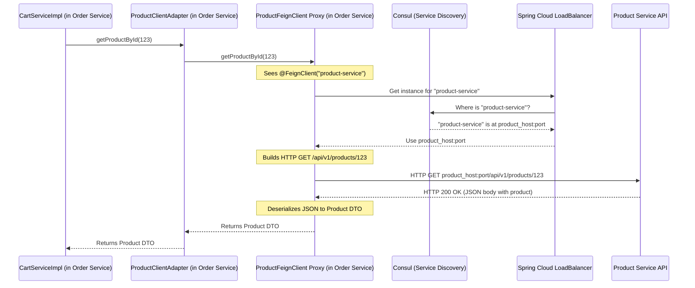

# Chapter 7: Inter-Service Communication (Feign Clients)

Welcome back! In [Chapter 6: Data Transfer Objects (DTOs) & Mappers](06_data_transfer_objects__dtos____mappers_.md), we learned how microservices use DTOs to send and receive structured data through their APIs, and how mappers help convert between these DTOs and internal domain entities. This is great for when external clients (like a web browser) talk to our services.

But what happens when our microservices need to talk to *each other*? Our e-commerce application is a team of specialized services. Sometimes, one service needs information or help from another to do its job.

## Why Do Services Need to Talk to Each Other? The Teamwork Problem

Imagine our `order-service`. When you, as a customer, want to add an item to your shopping cart, the `order-service` needs to do a couple of things:
1.  **Check if the product exists:** Is "Super Duper Gadget X" a real product?
2.  **Check if it's in stock:** Do we have enough "Super Duper Gadget X" for you to buy?
3.  **Get product details:** What's the price of the product to calculate the cart total?

But the `order-service` doesn't know these details itself! The `product-service` is the expert on all things product-related. So, the `order-service` needs a way to "ask" the `product-service` for this information.

This "asking" is called **inter-service communication**. One service makes a request (like an API call) to another service.

## What is Spring Cloud OpenFeign? Your Service's "Magic Phonebook"

Making network calls to other services can be a bit clunky. You'd have to:
*   Figure out the exact network address (IP and port) of the `product-service`. What if it changes? What if there are many `product-service` instances running?
*   Manually build an HTTP request (GET, POST, etc.).
*   Send the request and then parse the response (e.g., from JSON to a Java object).
*   Handle network errors.

This is a lot of repetitive work! **Spring Cloud OpenFeign** (often just called Feign) makes this much, much easier.

Think of Feign as a **magic phonebook for your services**:
1.  **You define an Interface (The Phonebook Entry):** In your `order-service`, you create a simple Java interface (like a page in your phonebook) that describes the "calls" you want to make to the `product-service`. For example, a method like `getProductDetails(productId)`.
2.  **Feign Makes the Call (Magic Connection):** When you call this interface method in your `order-service` code, Feign magically does all the hard work:
    *   **Finds the `product-service`:** It uses the service discovery tool (Consul, which we learned about in [Chapter 1: Centralized Configuration Management](01_centralized_configuration_management_.md)) to find out where `product-service` is currently running.
    *   **Handles Load Balancing:** If there are multiple instances of `product-service`, Feign (with help from tools like Spring Cloud LoadBalancer) picks one to talk to, spreading the load.
    *   **Constructs & Sends HTTP Request:** It builds the actual network request based on your interface definition.
    *   **Handles the Response:** It takes the response from `product-service` (e.g., product details in JSON format) and converts it back into a Java object for you.

It makes calling another microservice look almost like calling a regular local Java method!

## How Feign Works in Our `order-service`

Let's see how the `order-service` uses Feign to talk to the `product-service`.

### Step 1: Enabling Feign Clients in `order-service`

First, we need to tell our `order-service` that it's going to use Feign. We do this by adding an annotation to its main application class.

**File:** `order-service/src/main/java/com/example/order/OrderServiceApplication.java`
```java
package com.example.order;

import org.springframework.boot.SpringApplication;
import org.springframework.boot.autoconfigure.SpringBootApplication;
import org.springframework.cloud.client.discovery.EnableDiscoveryClient;
import org.springframework.cloud.openfeign.EnableFeignClients; // (1) Import this
import org.springframework.data.jpa.repository.config.EnableJpaAuditing;

@SpringBootApplication
@EnableFeignClients // (2) Enable Feign!
@EnableJpaAuditing
@EnableDiscoveryClient
public class OrderServiceApplication {

	public static void main(String[] args) {
		SpringApplication.run(OrderServiceApplication.class, args);
	}
}
```
*   **(1) `import org.springframework.cloud.openfeign.EnableFeignClients;`**: We import the necessary class.
*   **(2) `@EnableFeignClients`**: This magical annotation tells Spring Boot to scan our project for interfaces that are declared as Feign clients and set them up to work.

### Step 2: Defining the "Phonebook Entry" - The Feign Client Interface

Next, we create a Java interface in the `order-service` that describes the `product-service` APIs we want to call. This is our "phonebook entry."

**File:** `order-service/src/main/java/com/example/order/infrastructure/integration/ProductFeignClient.java`
```java
package com.example.order.infrastructure.integration;

import com.example.order.application.integration.dto.Product; // (1) DTO for product data
import org.springframework.cloud.openfeign.FeignClient;
import org.springframework.web.bind.annotation.GetMapping;
import org.springframework.web.bind.annotation.PathVariable;
import org.springframework.web.bind.annotation.RequestParam;

// (2) This is our Feign client for the 'product-service'
@FeignClient(name = "product-service", path = "/api/v1/products")
public interface ProductFeignClient {

    // (3) Asks product-service if a product with 'id' has enough 'quantity'
    @GetMapping("/{id}/availability")
    boolean checkProductAvailability(@PathVariable("id") Long id,
                                     @RequestParam("quantity") int quantity);

    // (4) Asks product-service for details of a product with 'id'
    @GetMapping("/{id}")
    Product getProductById(@PathVariable("id") Long id);
}
```
Let's break this down:
*   **(1) `import com.example.order.application.integration.dto.Product;`**: The `order-service` needs a way to understand the product data it gets back from `product-service`. So, it has its own `Product` DTO (Data Transfer Object) defined in its `application.integration.dto` package. This DTO represents the structure of product data `order-service` *expects* to receive. We learned about DTOs in [Chapter 6: Data Transfer Objects (DTOs) & Mappers](06_data_transfer_objects__dtos____mappers_.md).
*   **(2) `@FeignClient(name = "product-service", path = "/api/v1/products")`**: This is the core Feign annotation.
    *   `name = "product-service"`: This is super important! It tells Feign to look for a service named "product-service" in our service discovery system (Consul). Consul knows the actual IP address and port of the `product-service`.
    *   `path = "/api/v1/products"`: This is a base path that will be prepended to all requests made through this client. So, if a method here has `@GetMapping("/{id}")`, the full path will be `/api/v1/products/{id}`.
*   **(3) `@GetMapping("/{id}/availability")`**: This, along with `checkProductAvailability(...)`, defines a method to make an HTTP GET request.
    *   `"/{id}/availability"`: This is the path specific to this request, relative to the base path. So the full path would be `/api/v1/products/{id}/availability`.
    *   `@PathVariable("id") Long id`: This means the `id` parameter in the method will be used to fill the `{id}` part of the URL.
    *   `@RequestParam("quantity") int quantity`: This means the `quantity` parameter will be added as a URL query parameter (e.g., `?quantity=5`).
    *   `boolean`: The method expects the `product-service` to return a boolean value (true or false).
*   **(4) `@GetMapping("/{id}")`**: This defines another HTTP GET request.
    *   The full path would be `/api/v1/products/{id}`.
    *   `Product`: The method expects the `product-service` to return data that can be converted into our `order-service`'s `Product` DTO. Feign will handle converting the JSON response from `product-service` into this `Product` object.

This interface is just a blueprint. We don't write the actual code that makes the network call – Feign does that for us!

### Step 3: Using the Feign Client - Making the "Phone Call"

Now, how does `order-service` use this `ProductFeignClient`? It's typically used inside a service class. In our project, there's a nice abstraction:
1.  `ProductClient.java` (an interface in `application.integration`) defines application-level methods like `getProductById`.
2.  `ProductClientAdapter.java` (in `infrastructure.integration`) implements `ProductClient` and *uses* our `ProductFeignClient`.

This is good practice because it separates our application logic from the specific Feign technology. Let's look at how it's ultimately used in `CartServiceImpl.java`.

**File:** `order-service/src/main/java/com/example/order/application/service/CartServiceImpl.java` (Simplified)
```java
// ... other imports ...
import com.example.order.application.integration.ProductClient; // (1) Our application-level client
import com.example.order.application.integration.dto.Product;
import feign.FeignException; // (4) For handling Feign-specific errors
import lombok.AllArgsConstructor;
import lombok.extern.slf4j.Slf4j;
import org.springframework.stereotype.Service;

@Service
@AllArgsConstructor
@Slf4j
public class CartServiceImpl implements CartService {

    private final CartItemRepository cartItemRepository;
    private final ProductClient productClient; // (2) Spring injects our client adapter here

    // ... other methods like createCartItem, updateCartItem ...

    // Helper method to get product details (simplified from the project)
    private Product getProduct(long productId) {
        Product product = null;
        try {
            // (3) This looks like a local method call, but it's a remote call via Feign!
            product = productClient.getProductById(productId);
            log.info("Successfully retrieved product {} from product-service", productId);
        } catch (FeignException e) {
            // (5) Handle potential errors from the remote call
            if (e.status() == 404) { // HTTP 404 Not Found
                log.error("Product not found in product-service for id: {}", productId);
                throw new RuntimeException("Product not found with id: " + productId);
            }
            log.error("Failed to retrieve product from product-service. ID: {}, Status: {}, Message: {}",
                    productId, e.status(), e.getMessage());
            throw new RuntimeException("Failed to retrieve product with id: " + productId);
        }
        return product;
    }

    // This method uses getProduct()
    private Product validateProductAvailabilityAndGet(Long productId, int quantity) {
        Product product = getProduct(productId); // Calls the method above
        if (product == null || product.getStock() < quantity) {
            // ... handle out of stock or product not existing ...
            throw new ProductOutOfStockException("Product " + productId + " out of stock or not found.");
        }
        return product;
    }
}
```
*   **(1) `ProductClient`**: This is the interface our service logic uses.
*   **(2) `private final ProductClient productClient;`**: Thanks to Spring's dependency injection and our Feign setup, an actual working instance (the `ProductClientAdapter` which uses the Feign proxy) is provided here.
*   **(3) `product = productClient.getProductById(productId);`**: This is the magic! It *looks* like we're just calling a method on a local object. But behind the scenes, Feign is:
    *   Finding the `product-service` via Consul.
    *   Building an HTTP GET request to `/api/v1/products/{productId}`.
    *   Sending the request.
    *   Getting the JSON response.
    *   Converting that JSON into a `com.example.order.application.integration.dto.Product` object.
    *   Returning that object to us.
*   **(4) `FeignException`**: A specific exception type from Feign that we can catch.
*   **(5) `catch (FeignException e)`**: If the `product-service` returns an error (like 404 Not Found if the product doesn't exist), or if there's a network issue, Feign will throw an exception. We can catch this `FeignException` to handle these situations gracefully. For example, `e.status()` gives us the HTTP status code from the remote service.

It's that simple to make a call to another service!

## What Happens Under the Hood? Feign's Magic Revealed

Let's trace the journey when `order-service` calls `productClient.getProductById(123L)`:

1.  **Call in `order-service`**: Your `CartServiceImpl` calls `productClient.getProductById(123L)`.
2.  **Adapter Call**: This call goes to `ProductClientAdapter`, which in turn calls the `getProductById(123L)` method on the injected `ProductFeignClient` interface.
3.  **Feign Proxy Steps In**: Spring and Feign have created a dynamic proxy (an "on-the-fly" implementation) for your `ProductFeignClient` interface. This proxy intercepts the call.
4.  **Interprets Annotations**: The proxy looks at the `@FeignClient(name = "product-service", ...)` annotation on the interface and the `@GetMapping("/{id}")` annotation on the `getProductById` method.
5.  **Service Discovery (Hello Consul!)**:
    *   The proxy asks Spring Cloud's `DiscoveryClient` (which talks to Consul): "Where can I find an instance of the service named `product-service`?"
    *   Consul replies with the network address (e.g., `http://192.168.1.50:8001`) of an available `product-service` instance.
    *   If multiple instances of `product-service` are registered, a **Load Balancer** (like Spring Cloud LoadBalancer) helps pick one, distributing requests to avoid overloading any single instance.
6.  **HTTP Request Construction**: The Feign proxy, using an underlying HTTP client library (like Apache HttpClient or OkHttp), constructs the actual HTTP GET request. Based on our annotations, this would be: `GET http://192.168.1.50:8001/api/v1/products/123`.
7.  **Request Sent, Response Received**: The HTTP request is sent over the network to the chosen `product-service` instance. The `product-service` processes it and sends back an HTTP response, typically with a JSON body containing the product details.
8.  **Response Processing (Deserialization)**: The Feign proxy receives this response. It uses a **decoder** (usually Jackson for JSON, which we configured in [Chapter 6](06_data_transfer_objects__dtos____mappers_.md) implicitly) to convert the JSON body into an instance of `order-service`'s `com.example.order.application.integration.dto.Product` class.
9.  **Return Value**: This `Product` object is then returned from the `productFeignClient.getProductById(123L)` call, back through the adapter, and finally to your `CartServiceImpl`.

Here's a simplified diagram of this flow:



It's quite a bit of work, but Feign and Spring Cloud handle it all seamlessly for you!

## DTOs: The Common Language Between Services

Notice how the `order-service` has its own `Product` DTO in `com.example.order.application.integration.dto.Product`. This DTO defines the structure of the product data that `order-service` *expects* to receive from the `product-service` when it calls the `/api/v1/products/{id}` endpoint.

*   This `Product` DTO in `order-service` doesn't have to be identical to the `ProductResponse` DTO or the internal `Product` entity within the `product-service`.
*   However, it **must match the fields and structure of the JSON that the `product-service`'s `/api/v1/products/{id}` endpoint actually returns**. If `product-service` returns JSON like `{"id": 1, "name": "T-Shirt", "currentPrice": 19.99}`, then `order-service`'s `Product` DTO should have fields like `id`, `name`, and `currentPrice` (or however they are named in the JSON) to correctly deserialize the response.

These DTOs act as a contract or a common language between the services for specific interactions.

## A Quick Note on Error Handling

As seen in the `CartServiceImpl`'s `getProduct` method, when a Feign call fails (e.g., network error, or the remote service returns an HTTP error like 404 Not Found or 500 Internal Server Error), Feign typically throws a `FeignException`.

You can catch `FeignException` and inspect its `status()` method to get the HTTP status code from the remote service, allowing you to handle different errors in different ways. For more advanced scenarios, Feign also allows you to configure custom `ErrorDecoder`s to translate these exceptions into more specific, application-domain exceptions.

## Benefits of Using Feign

*   **Simplicity:** Writing client code for REST APIs becomes much cleaner and looks like calling local Java methods.
*   **Declarative:** You define *what* you want to call (the interface and annotations), not *how* to make the call.
*   **Integration:** Works seamlessly with service discovery (like Consul) and client-side load balancing (like Spring Cloud LoadBalancer).
*   **Reduced Boilerplate:** You don't have to write manual HTTP connection management, request building, or response parsing code.

## Conclusion

You've now learned how microservices in our `E-Commerce-Microservice-master` project can communicate with each other using Spring Cloud OpenFeign. Feign provides a powerful and elegant way to create declarative REST clients, making inter-service calls look like simple local method invocations.

By defining a "magic phonebook" (a Feign client interface), services like `order-service` can easily request information or trigger actions in other services like `product-service`, all while Feign handles the underlying complexities of network communication, service discovery, and load balancing. This is essential for building a collaborative system of microservices that work together to deliver the full functionality of our e-commerce platform.

This chapter concludes our tour through the core concepts of the `E-Commerce-Microservice-master` project. We hope this journey has given you a solid, beginner-friendly understanding of how these different pieces fit together to build a modern, scalable, and robust e-commerce application!

---

