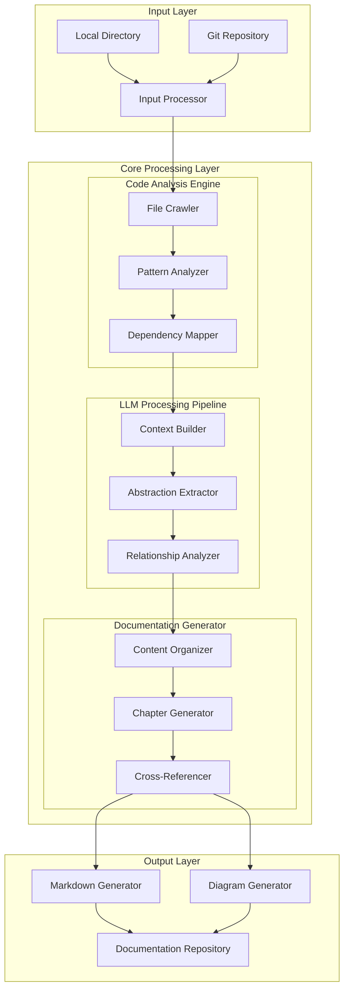
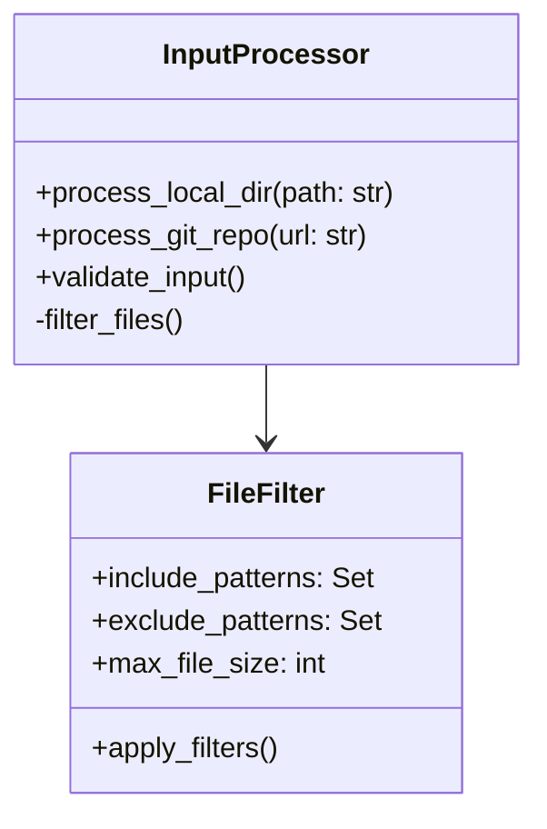
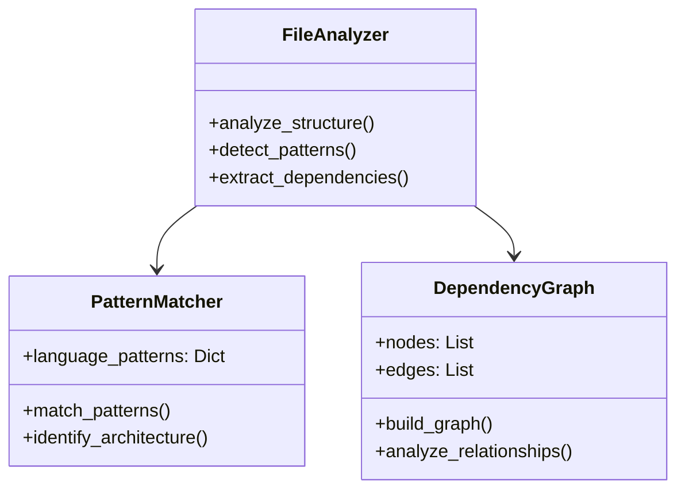
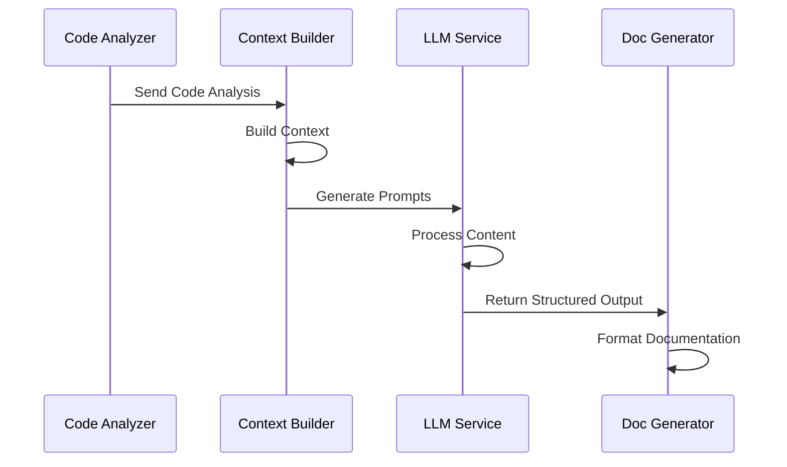
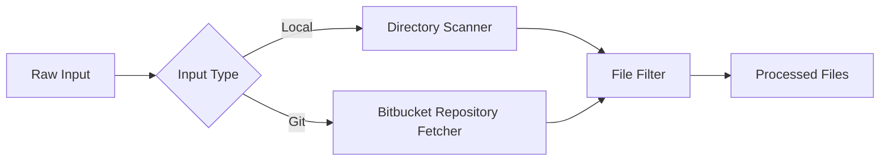
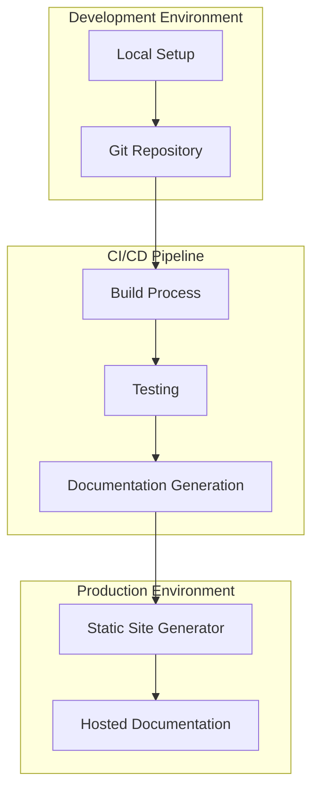

# Technical Architecture Documentation: Tutorial Codebase Knowledge System

## System Overview

The Tutorial Codebase Knowledge system is an advanced documentation generation platform that leverages LLMs (Large Language Models) to automatically analyze, understand, and document codebases. The system employs a modular architecture with distinct processing pipelines to generate comprehensive, maintainable documentation.

## Architecture Overview
The system follows a three-layer architecture designed for efficient documentation generation. The Input Layer accepts code from either local directories or Git repositories and processes them through a unified Input Processor. The Core Processing Layer contains three main engines: the Code Analysis Engine for understanding code structure and patterns, the LLM Processing Pipeline for intelligent content analysis and abstraction, and the Documentation Generator for organizing and creating coherent documentation. Finally, the Output Layer generates both markdown content and diagrams, storing them in a documentation repository. This pipeline ensures a systematic transformation of raw code into comprehensive, well-structured documentation.



## Component Details

### 1. Input Processing Layer
The Input Processing Layer serves as the system's entry point, providing a flexible and robust mechanism for ingesting code from multiple sources. It implements a dual-channel approach, handling both local directory scanning and Git repository processing through a unified InputProcessor interface. The layer incorporates sophisticated file filtering capabilities through the FileFilter class, which enforces configurable rules for file inclusion, exclusion, and size limitations. This ensures that only relevant code files are processed while maintaining system performance and security. The layer's modular design allows for easy extension to support additional input sources while maintaining consistent validation and preprocessing across all input channels.



#### Implementation Details
- **File Crawling**: `utils/crawl_local_files.py`
  - Configurable file patterns
  - Size limitations
  - Exclusion patterns
- **Git Integration**: `utils/crawl_git_files.py`
  - Repository cloning
  - Branch management
  - Access token handling

### 2. Code Analysis Engine

The Code Analysis Engine forms the analytical backbone of the system, employing a sophisticated three-component architecture to comprehensively understand codebases. The FileAnalyzer serves as the primary entry point, coordinating the analysis process by examining code structure, identifying patterns, and mapping dependencies. It works in conjunction with the PatternMatcher, which leverages a comprehensive dictionary of language-specific patterns to identify architectural styles and design patterns across different programming languages. The DependencyGraph component constructs and analyzes relationship graphs between code elements, providing crucial insights into code organization and dependencies. Together, these components enable deep, language-agnostic analysis of code structure and relationships, forming the foundation for intelligent documentation generation.



#### Key Features
- Language-agnostic analysis
- Design pattern recognition
- Dependency mapping
- Architecture identification

### 3. LLM Processing Pipeline
The LLM Processing Engine serves as the intelligent core of the documentation system, transforming raw code analysis into meaningful documentation. It employs a sophisticated pipeline where the Context Builder first aggregates and structures code analysis results, creating rich contextual prompts that capture the essence of the codebase. These prompts are then processed by the LLM service (supporting multiple providers like Gemini, OpenAI, and Anthropic) which generates human-readable, technically accurate documentation. The engine includes built-in mechanisms for caching responses, handling rate limits, and recovering from errors, ensuring reliable and efficient documentation


#### Implementation Details
- **Context Building**: `nodes.py`
  ```python
  class ContextBuilder(Node):
      def prep(self, shared):
          return self.build_context(shared["files"])
      
      def exec(self, context):
          return self.process_with_llm(context)
  ```

- **LLM Integration**: `utils/call_llm.py`
  - Multiple provider support (Gemini, OpenAI, Anthropic)
  - Caching mechanism
  - Rate limiting handling
  - Error recovery

 


### 4. Documentation Generator
The Documentation Generator is the final processing stage that transforms the LLM-generated content into well-structured, navigable documentation. It begins with Content Organization, which logically arranges the generated content based on relationships and importance. The system then applies appropriate templates through Template Selection, ensuring consistent formatting and presentation. During Content Generation, it assembles the documentation while maintaining technical accuracy and readability. The Cross-Reference Creation phase establishes intelligent links between related sections, enhancing navigation and understanding. Finally, Format Conversion transforms the content into various output formats, supporting both markdown and diagram generation for comprehensive documentation delivery.


#### Output Structure
```
project_docs/
├── index.md                 # Main entry point
├── architecture/
│   ├── overview.md         # System overview
│   ├── components.md       # Component details
│   └── patterns.md         # Design patterns
├── implementation/
│   ├── setup.md           # Setup instructions
│   ├── configuration.md   # Configuration details
│   └── examples.md        # Usage examples
└── api/
    ├── interfaces.md      # API documentation
    └── integration.md     # Integration guides
```

## Data Flow
### 1. Input Processing
The Input Processing data flow implements a streamlined approach to handle diverse code sources. Starting with Raw Input, the system first determines the Input Type, branching into two specialized processing paths: the Directory Scanner for local filesystem inputs and the Repository Fetcher for Git-based sources. Both paths converge at the File Filter stage, which applies consistent filtering rules (file types, sizes, and exclusion patterns) across all inputs. This unified filtering approach ensures that regardless of the input source, the system produces a standardized set of Processed Files ready for subsequent analysis. The design emphasizes both flexibility in input handling and consistency in output, making the system adaptable while maintaining reliable processing standards.


### 2. Analysis Pipeline


## Implementation Guidelines

### 1. Configuration Management
```yaml
# config.yaml
input:
  include_patterns:
    - "*.py"
    - "*.java"
    - "*.js"
  exclude_patterns:
    - "test/*"
    - "docs/*"
  max_file_size: 100000

llm:
  provider: "gemini"
  model: "gemini-2.5-pro-preview-03-25"
  temperature: 0.7
  
output:
  format: "markdown"
  diagrams: true
  cross_references: true
```

### 2. Error Handling
```python
class ProcessingNode(Node):
    def exec_fallback(self, prep_res, exc):
        logger.error(f"Processing failed: {exc}")
        return {
            "status": "error",
            "message": str(exc),
            "fallback_content": self.generate_fallback(prep_res)
        }
```

### 3. Performance Optimization
- Caching strategy for LLM calls
- Parallel processing for file analysis
- Incremental documentation updates
- Memory-efficient file processing

## Security Considerations

### 1. API Key Management
- Environment variable usage
- Key rotation policies
- Access scope limitations

### 2. Code Analysis Security
- File size limitations
- Content validation
- Execution prevention

### 3. Output Validation
- Content sanitization
- Reference verification
- Format validation

## Monitoring and Maintenance

### 1. Logging
```python
# Structured logging implementation
logging.config.dictConfig({
    'version': 1,
    'handlers': {
        'console': {
            'class': 'logging.StreamHandler',
            'formatter': 'standard'
        },
        'file': {
            'class': 'logging.FileHandler',
            'filename': 'processing.log',
            'formatter': 'detailed'
        }
    },
    'formatters': {
        'standard': {
            'format': '%(asctime)s - %(name)s - %(levelname)s - %(message)s'
        },
        'detailed': {
            'format': '%(asctime)s - %(name)s - %(levelname)s - %(message)s - %(context)s'
        }
    }
})
```

### 2. Metrics
- Processing time per file
- LLM token usage
- Error rates
- Documentation coverage

## Deployment Architecture



## Integration Points

### 1. Version Control
- Git repository integration
- Branch-specific documentation
- Version tagging

### 2. CI/CD Integration
- Automated documentation updates
- Quality checks
- Deployment automation

### 3. External Tools
- IDE plugins
- Documentation platforms
- Collaboration tools

## Future Enhancements

### 1. Planned Features
- Real-time documentation updates
- Multi-language support expansion
- Interactive documentation features
- Advanced visualization options

### 2. Scalability Improvements
- Distributed processing
- Cloud integration
- Performance optimization

## Conclusion

This technical architecture provides a robust foundation for automated documentation generation, leveraging modern AI capabilities while maintaining flexibility and extensibility. The system's modular design allows for easy updates and enhancements while ensuring reliable documentation output. 
