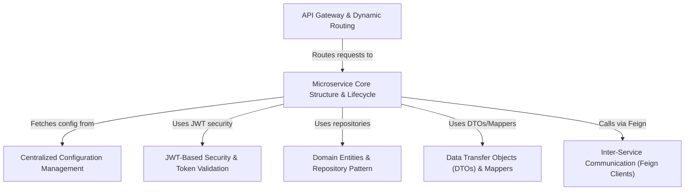

# Tutorial: E-Commerce-Microservice-master

This project is an *e-commerce platform* built with a **microservice architecture**.
It includes separate services for managing users, products, and orders, each developed as an independent *Spring Boot application*.
An **API Gateway** acts as the main entry point, routing requests to the correct service with the help of **Service Discovery** (Consul).
Configuration for all services is managed centrally by a **Config Server**.
Security is handled using **JSON Web Tokens (JWTs)** for authenticating users and authorizing API access, with a shared library for token validation.
Services communicate with each other using declarative HTTP clients like *OpenFeign*, for example, the Order service fetching product details from the Product service.

**Source Repository:** [None](None)

## Chapters

1. [Centralized Configuration Management
](01_centralized_configuration_management_.md)
2. [API Gateway & Dynamic Routing
](02_api_gateway___dynamic_routing_.md)
3. [Microservice Core Structure & Lifecycle
](03_microservice_core_structure___lifecycle_.md)
4. [JWT-Based Security & Token Validation
](04_jwt_based_security___token_validation_.md)
5. [Domain Entities & Repository Pattern
](05_domain_entities___repository_pattern_.md)
6. [Data Transfer Objects (DTOs) & Mappers
](06_data_transfer_objects__dtos____mappers_.md)
7. [Inter-Service Communication (Feign Clients)
](07_inter_service_communication__feign_clients__.md)

---

