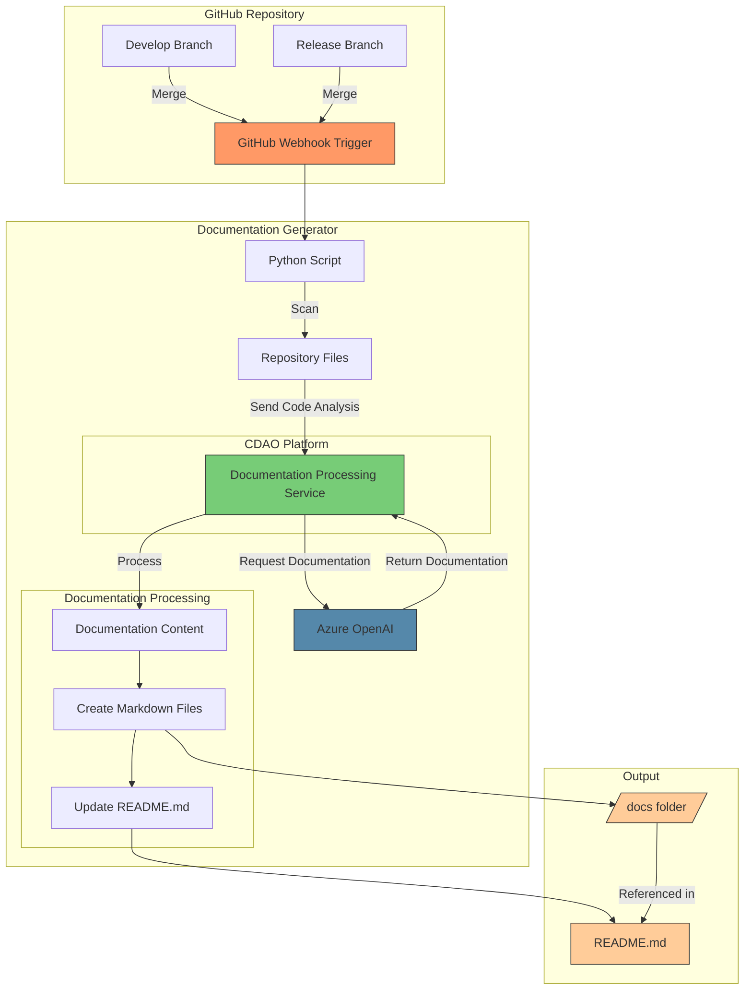

# Automated Documentation Generation Architecture

## Architecture Components

1. **GitHub Repository**
   - Monitors merges to Develop and Release branches
   - Webhook configured to trigger on merge events

2. **Documentation Generator**
   - **Python Script**
     - Triggered by GitHub webhook
     - Scans repository files for analysis
     - Sends code analysis to CDAO Platform
     - Processes generated documentation

   - **CDAO Platform**
     - Processes code analysis
     - Interfaces with Azure OpenAI for documentation generation
     - Handles secure API access and rate limiting
     - Manages documentation workflow

   - **Azure OpenAI**
     - External AI service
     - Generates comprehensive documentation based on code analysis
     - Accessed through CDAO Platform

3. **Documentation Processing**
   - Takes AI-generated documentation content
   - Creates organized markdown files
   - Updates README.md with documentation links

4. **Output Management**
   - Stores generated documentation in /docs folder
   - Updates README.md with organized links
   - Maintains documentation structure

## Implementation Notes

1. **Webhook Configuration**
   - Configure webhook in GitHub repository settings
   - Set trigger events for push/merge to Develop and Release branches
   - Specify webhook endpoint URL

2. **Security Considerations**
   - Implement webhook secret validation
   - Secure CDAO platform credentials
   - Use appropriate GitHub permissions

3. **Documentation Organization**
   - Maintain consistent folder structure in /docs
   - Use clear naming conventions for generated files
   - Ensure proper linking in README.md

4. **Error Handling**
   - Implement retry mechanisms for API calls
   - Log errors and notifications
   - Handle partial documentation updates
