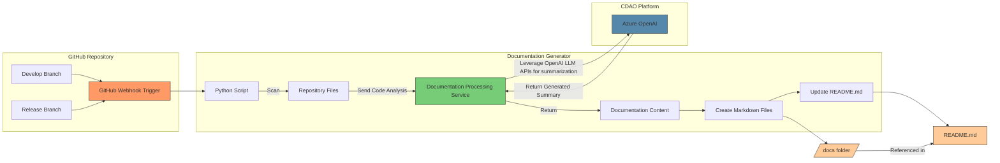

# Automated Documentation Generation Architecture

```mermaid
graph LR
    subgraph "GitHub Repository"
        B1[Develop Branch] & B2[Release Branch] --> T1[GitHub Webhook Trigger]
    end

    subgraph "Documentation Generator"
        T1 --> P1[Python Script]
        P1 --> |Scan| F1[Repository Files]
        F1 --> |Send Code Analysis| C1
        D1[Documentation Content] --> D2[Create Markdown Files]
        D2 --> D3[Update README.md]
    end

    subgraph "CDAO Platform"
        C1[Documentation Processing Service]
        AO[Azure OpenAI]
        C1 --> |Leverage OpenAI LLM APIs for summarization| AO
        AO --> |Return Generated Summary| C1
    end

    C1 --> |Return| D1
    D2 --> O1[/docs folder/]
    D3 --> O2[README.md]
    O1 --> |Referenced in| O2

    style T1 fill:#f96,stroke:#333
    style C1 fill:#7c7,stroke:#333
    style AO fill:#58a,stroke:#333
    style O1 fill:#fc9,stroke:#333
    style O2 fill:#fc9,stroke:#333
```

